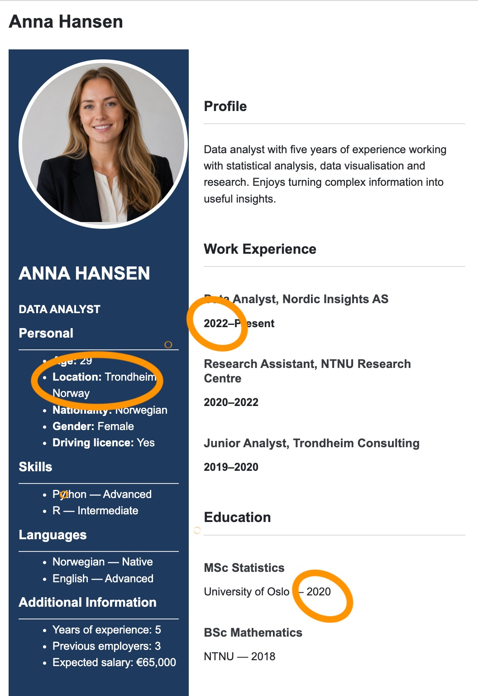
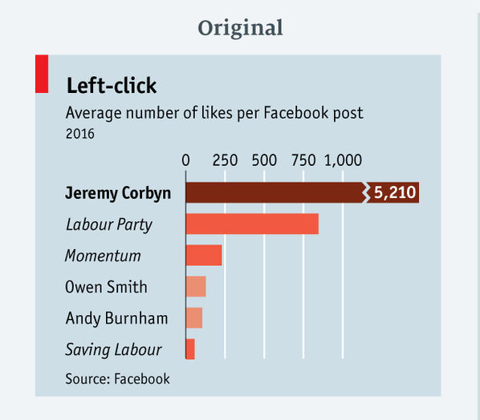
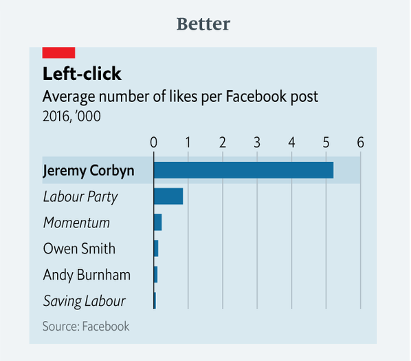
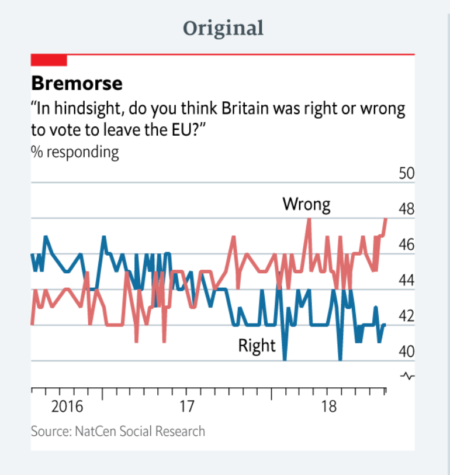
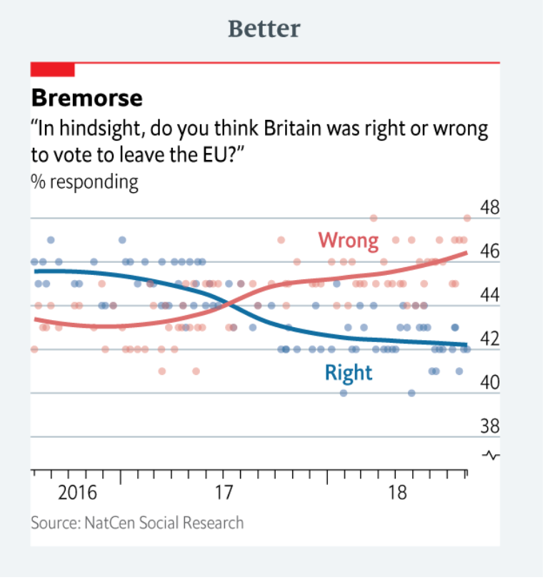
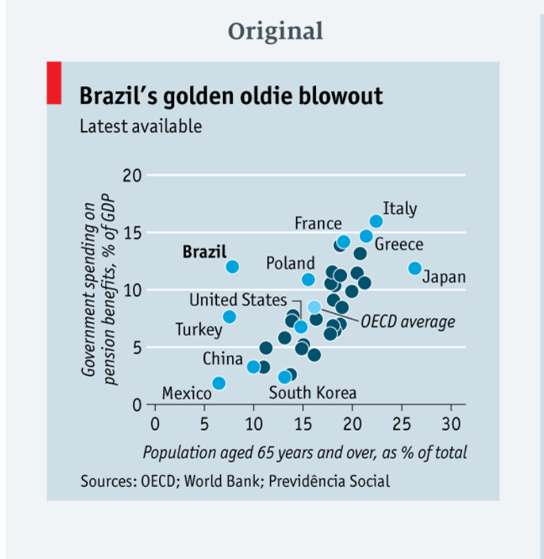
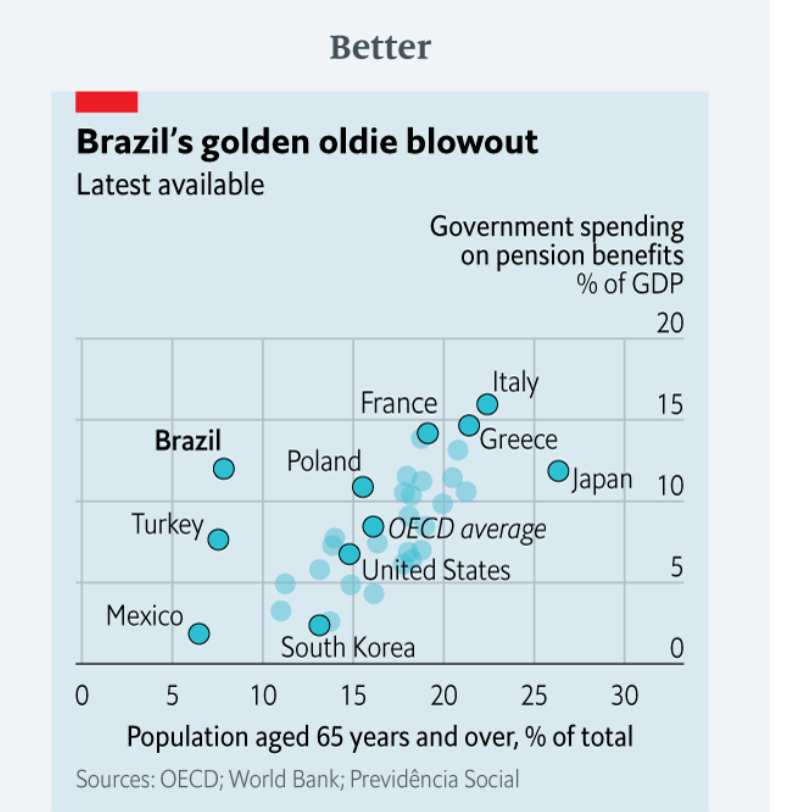
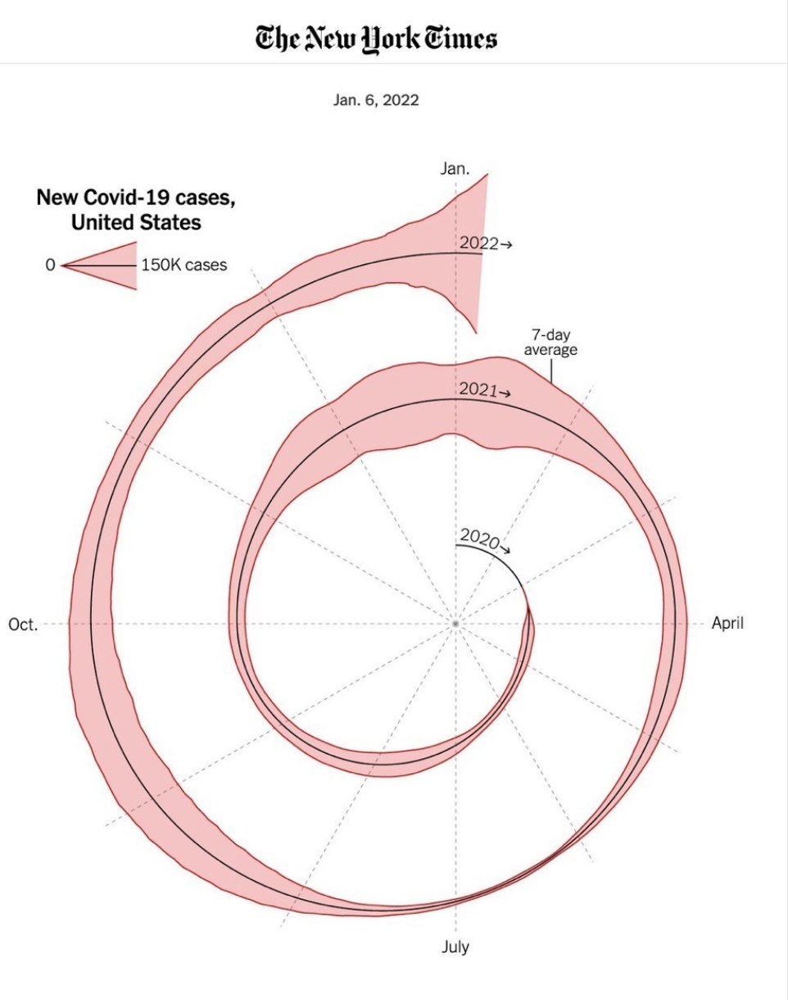

## Plan for today Wednesday August 26th 

 - About the course and requirements (some repetition) 
 - Reference Group
  
  
 - What is data?
 - How and why do we talk about data visualization?
 
 
 - Create Group on Canvas
 - Getting to know a dataset 
 
 
## But first...

- 2-3 minutes to get to know the persons at your table
- Ask each other:

  - How comfortable are you with Python?
  - Are you familiar with AI chat? Have you used AI to generate code?
  - Who, i the group, will do the coding and submission of the assignment?

## What the course description implies

You will gain generic **skills** in handling, interpreting and discussing data, modelling, prediction etc etc.

This is accomplished mainly through **examples and group work** and only a few lectures.

If you need more fundamental/theoretical knowledge you should rather consider

- TMA4267 Linear statistical models (for multiple linear regression)

- TMA4268 Statistical learning (for machine learning)

## Portfolio assessment

- Individual letter grades (A-F) are set based on your portfolio ("mappe")

- All elements of the portfolio are completed in groups

- The group work is done mostly **during class hours**

  - You will at times be assigned some preparatory homework

  - We are not interested in polished project reports

## Portfolio assessment

- The portfolio will consist of 3 types of activities:8 smaller activities, participation (hand-in) counts 5 points each, but at most 30 points

  - Project 1: 2 hand-ins, at most 30 points (mandatory)

  - Project 2: 3 hand-ins, at most 50 points (mandatory)

- Everything will be delivered in Canvas **during class hours**

## What the course description implies

You will gain generic **skills** in handling, interpreting and discussing data, modelling, prediction etc etc.

This is accomplished mainly through **examples and group work** and only a few lectures.

If you need more fundamental/theoretical knowledge you should rather consider

- TMA4267 Linear statistical models (for multiple linear regression)

- TMA4268 Statistical learning (for machine learning)

## Portfolio assessment

- Individual letter grades (A-F) are set based on your portfolio ("mappe")

- All elements of the portfolio are completed in groups

- The group work is done mostly **during class hours**

  - You will at times be assigned some preparatory homework

  - We are not interested in polished project reports

## Portfolio assessment

- The portfolio will consist of 3 types of activities:

  - 8 smaller activities, participation (hand-in) counts 5 points each, but at most 30 points

  - Project 1: 2 hand-ins, at most 30 points (mandatory)

  - Project 2: 3 hand-ins, at most 50 points (mandatory)

- Everything will be delivered in Canvas **during class hours**

- No exam!

- You have to **show up and participate**

## Groups and group work

- About 5 students per group

- Groups stay together for about two weeks, then rotate

- Groups hand in assignments and projects jointly through Canvas

## Tentative calendar for assessments/projects{.smaller}

| Week | Date |Planned Activity | Delivery |
|---------|:-----|------:|:------:|
| 35      | Wed 26.08   |  Visualization/Python |  Yes (does not count)   |
|         | Fri 28.08   |             |  No                      |
| 36      | Wed 02.09        |  |         |
|         | Fri 04.09   |             |                        |
| 37      | Wed 09.09        |  |         |
|         | Fri 11.09   |             |                        |
| 38      | Wed 16.09        |  |         |
|         | Fri 18.09        |  |         |

## Reference Group

- We need (at least) two students to be in the reference group

- What is the role of the reference group?
  
  - Communication between the class and the teachers
  - Three meetings a semester
  - Write a short report at the end of the semester
  - Possibility to discuss the course development

## What is data? 

- Menti

Note: ...although the word "data" is plural, "is" sounds better..

## What is data?

“All is data”

everything happening in  counts as data, including interviews, observations, documents, and background context.

Glaser, Barney G. "All Is Data." Grounded Theory Review, vol. 6, no. 2, 2007, pp. 1–22.

## What is data?

"information, especially facts or numbers, collected to be examined and considered and used to help decision-making, or information in an electronic form that can be stored and used by a computer" 

Cambridge dictionary

## Data came in different type 

Some terminology

::: {.columns}

::: {.column width="40%"}

:::

::: {.column width="60%"}

- Profile statement → _Qualitative_
- Profile photo  → _Image_
:::

:::

## Data came in different type 

Some terminology

::: {.columns}

::: {.column width="40%"}

:::

::: {.column width="60%"}

**Quantitative**:  

- Age, salary, years of experience → _quantitative / continuous_
- Number of language spoken → _quantitative / discrete_

:::

:::

## Data came in different type 

Some terminology

::: {.columns}

::: {.column width="40%"}

:::

::: {.column width="60%"}

**Categorical**:  

- Location, nationality, driving licence → nominal
- Skill levels, language proficiency → ordinal
:::

:::

## Data came in different type 

Some terminology

::: {.columns}

::: {.column width="40%"}

:::

::: {.column width="60%"}

**Space and time**:  

- year of graduation, day of birth → time
- city → space
:::

:::

## Why data visualization?{.smaller}

A visualization turns data into something we can _see_, _compare_, and _reason about_.

. . .

**Why do we visualize?**

- **Find patterns and explore the data** — trends, clusters, relationships
-  **Compare** — groups, categories, values
- **See change** — especially over time or space
- **Spot unusual values** — outliers and anomalies
- **Understand complexity** — make large datasets easier to explore
- **Communicate** — explain findings to other people

## What makes good visualization?{.smaller}

Some good principles (among many others!)

1. **Start with a question**  What do I want to communicate?

## What makes good visualization?{.smaller}

Some good principles (among many others!)

1. **Start with a question**  What do I want to communicate?

2. **Choose the right visual form**  Match the chart to the question.

    - Change over time → line plot
    - Distribution → histogram
    - Relationship between two variables → scatter plot
    - Location → map

## What makes good visualization?{.smaller}

Some good principles (among many others!)

1. **Start with a question**  What do I want to communicate?

2. **Choose the right visual form**  Match the chart to the question.

   

3. **Be honest**  Don't distort the message 

    - misleading axes
    - inappropriate scales
    - cherry-picked data
    - unnecessary 3D effects

## What makes good visualization?{.smaller}

Some good principles (among many others!)

1. **Start with a question**  What do I want to communicate?

2. **Choose the right visual form**  Match the chart to the question.

 

3. **Be honest**  Don't distort the message 

 
4. **Remove the unnecessary**

    - Avoid decoration that doesn't communicate information.

## Example 1

- what is the meaning of the different colours?
- how many more like does Corbyn gets?

Examples from "Mistakes we have drawn a few. Learning from our errors in data visualization" The Economist March 27, 2019

::: {.notes}

article at:

https://www.scribd.com/document/841286524/Mistakes-we-ve-drawn-a-few-Learning-from-our-errors-in-data-by-Sarah-Leo-The-Economist

better figures from

https://marievozanne.github.io/Misleading-and-Confusing-Charts---Exercises.pdf

:::
## Example 1

::: {.columns}

::: {.column}

{width="100%"}

:::

::: {.column}

{width="100%"}

:::

:::

::: {.notes}
The improved graph is cleaner (less colours) and makes the scale clear

:::

## Example 2

{width="100%"}

- is people's opinion really so erratic?
- can we better highlight trends?

## Example 2

::: {.columns}

::: {.column}

{width="100%"}

:::

::: {.column}

{width="100%"}

:::

:::

::: {.notes}
The improved graph has original data as points and a fitted model to show the trends. Note also the larger scale.

Note: here we have the output of a statistical model show in the plot

Recommended when one does not have 0 as baseline. From the paper: 

:::

## Example 3

{width="100%"}

- what i the difference between light and dark blue countries?

## Example 3

::: {.columns}

::: {.column}

{width="100%"}

:::

::: {.column}

{width="100%"}

:::

:::

::: {.notes}
the dark blue ones are those that are labelled. the new graph makes this easier to read

:::

## Example 4

{fig-align="center"}

- How long is 2020? how about 2021?

## Create Groups in Canvas

On your desk you will find a sheet with a number, **this is your group number for the next two weeks** (until September 4th)

- Log into Canvas
- Click on **People** on the right side of the page
- Click on **Group** 
- Scroll to the group with the number on your desk and enroll yourself in the group

**NOTE** Remember your Group number for next week, you will have to enroll again!!!

## Our First data Assignment

The world's first virtual fencing system

## How Nofence works{.smaller}

You can learn more about this company from their  website [https://www.nofence.com/](https://www.nofence.com/)

## Assignement

- Log into Canvas 

- Find the assignement **Visualization Week 35**

- You'll find two files:

  1. Data: `norway_seqs_df.parquet`
  2. Instructions: `visualization_week35.ipynb`
  
- Download both of them

- Log into the NTNU JupiterHub [https://jupyter.ntnu.no/](https://jupyter.ntnu.no/)
  
- Drag the instruction file into   the workspace. Here you find instruction about your tasks.

## What to deliver

In Canvas you should deliver:

1. A file (word or any other format) with the questions you want to ask to the owner of the data
2. The `visualization_week35.ipynb` with the code you produced
3. A `html` file with the plots you have created
## For next time

