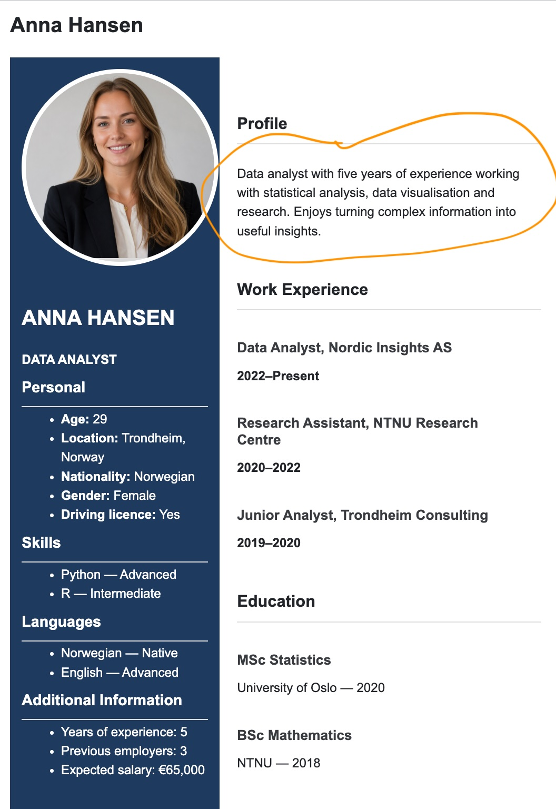
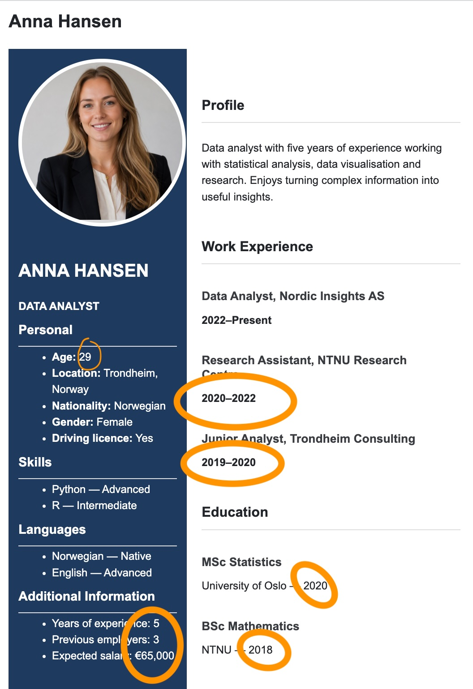
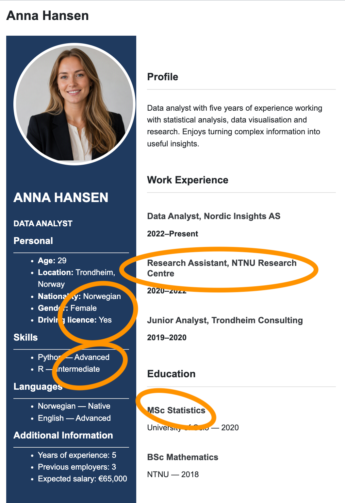
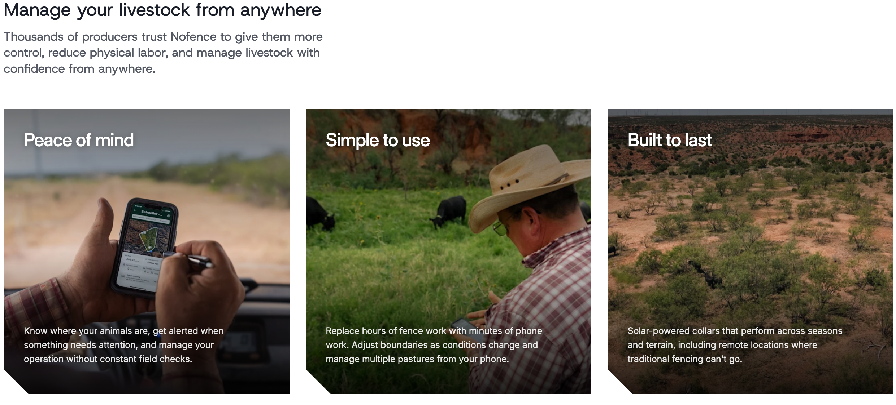
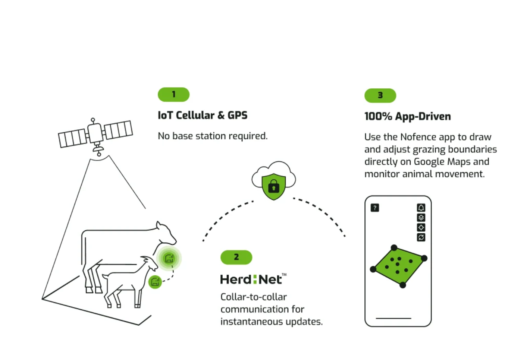

## Plan for today Wednesday August 26th 

 - What is data?
 - How and why do we talk about data visualization?
 
 
 - Create Group on Canvas
 - Getting to know a dataset 
 
 
## But first...

- 2-3 minutes to get to know the persons at your table
- Decide who will do the coding and submission of the assignment

## What is data? 

- Menti

Note: ...although the word "data" is plural, "is" sounds better..

## What is data?

“All is data”

everything happening in  counts as data, including interviews, observations, documents, and background context.

Glaser, Barney G. "All Is Data." Grounded Theory Review, vol. 6, no. 2, 2007, pp. 1–22.

## What is data?

"information, especially facts or numbers, collected to be examined and considered and used to help decision-making, or information in an electronic form that can be stored and used by a computer" 

Cambridge dictionary

## Data came in different type 

Some terminology

::: {.columns}

::: {.column width="40%"}

:::

::: {.column width="60%"}

- Profile statement → _Qualitative_
- Profile photo  → _Image_
:::

:::

## Data came in different type 

Some terminology

::: {.columns}

::: {.column width="40%"}

:::

::: {.column width="60%"}

**Quantitative**:  

- Age, salary, years of experience → _quantitative / continuous_
- Number of language spoken → _quantitative / discrete_

:::

:::

## Data came in different type 

Some terminology

::: {.columns}

::: {.column width="40%"}

:::

::: {.column width="60%"}

- Location, nationality, driving licence → nominal
- Skill levels, language proficiency → ordinal
:::

:::

## Create Groups in Canvas

On your desk you will find a sheet with a number, **this is your group number for the next two weeks** (until September 4th)

- Log into Canvas
- Click on **People** on the right side of the page
- Click on **Group** 
- Scroll to the group with the number on your desk and enroll yourself in the group

**NOTE** Remember your Group number for next week, you will have to enroll again!!!

## Our First data Assignment

The world's first virtual fencing system

## How Nofence works{.smaller}

You can learn more about this company from their  website [https://www.nofence.com/](https://www.nofence.com/)

## Assignement

- Log into Canvas 

- Find the assignement **Visualization Week 35**

- You'll find two files:

  1. Data: `norway_seqs_df.parquet`
  2. Instructions: `visualization_week35.ipynb`
  
- Download both of them

- Log into the NTNU JupiterHub [https://jupyter.ntnu.no/](https://jupyter.ntnu.no/)
  
- Drag the instruction file into   the workspace. Here you find instruction about your tasks.

## For next time

