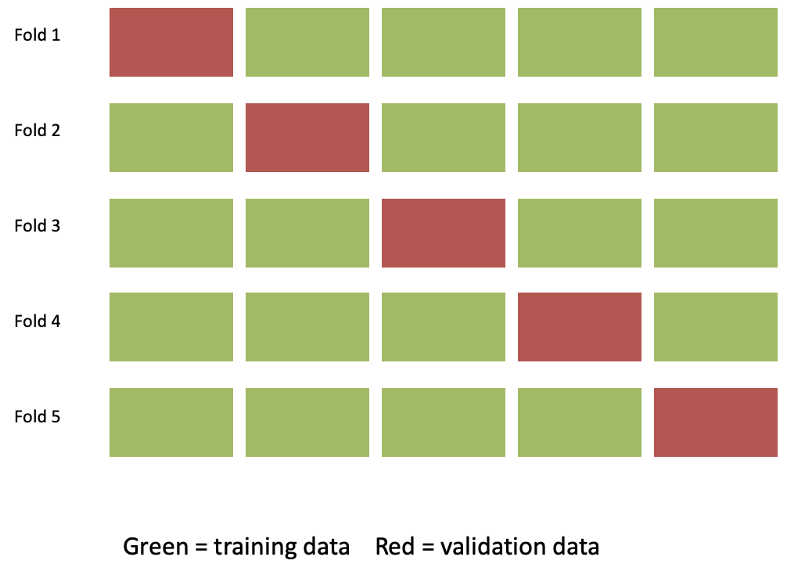

## From regression to machine learning

Imagine we want to create a predictive model for these data

```{r}
library(tidyverse)

set.seed(123)


n <- 1000

hours <- runif(n, 0, 10)
age   <- runif(n, 10, 15)

eta <- -17 +
  0.5 * hours +
  0.75 * age +
  0.45 * (hours - 4)^2 * (age - 10.5)

p <- plogis(eta)

y <- rbinom(n, 1, p)

df <- tibble(
  hours,
  age,
  y
)

ggplot(df,
       aes(hours, age,
           colour = factor(y))) +
  geom_point()+
    labs(
    x = "Hours smartphone use",
    y = "Age",
    colour = "Observed"
  )
```

## From regression to machine learning

We can use logistic regression as before ...

```{r}
log_fit <- glm(
  y ~ hours + age,
  family = binomial,
  data = df
)


library(kknn)

knn_fit <- kknn(
  factor(y) ~ hours + age,
  train = df,
  test  = df,
  k = 25,
  kernel = "rectangular"
)

grid <- expand.grid(
  hours = seq(min(df$hours),
              max(df$hours),
              length.out = 200),
  age   = seq(min(df$age),
              max(df$age),
              length.out = 200)
)

grid$prob_logit <- predict(
  log_fit,
  newdata = grid,
  type = "response"
)

knn_grid <- kknn(
  factor(y) ~ hours + age,
  train = df,
  test = grid,
  k = 15,
  kernel = "rectangular"
)

grid$prob_knn <- knn_grid$prob[,2]


grid_long <- 
  grid %>%
    transmute(
      hours,
      age,
      prob = prob_logit,
      model = "Logistic regression"
    )

ggplot() +

  geom_raster(
    data = grid_long,
    aes(hours, age, fill = prob),
    alpha = 0.7
  ) +

  geom_contour(
    data = grid_long,
    aes(hours, age, z = prob),
    breaks = 0.5,
    colour = "black",
    linewidth = 1.2
  ) +

  geom_point(
    data = df,
    aes(hours, age, colour = factor(y)),
    alpha = .8,
    size = 1.5
  ) +

  facet_wrap(~model) +

  scale_fill_viridis_c(
    name = "Predicted\nProbability"
  ) +

  labs(
    x = "Hours smartphone use",
    y = "Age",
    colour = "Observed"
  ) +

  theme_minimal(base_size = 14)
```

. . .

..but could we do better?

## From regression to machine learning

We might want less rigid models that can capture more characteristics of the data...

```{r}

grid_long <- 

  grid %>%
    transmute(
      hours,
      age,
      prob = prob_knn,
      model = "kNN"
    )


ggplot() +

  geom_raster(
    data = grid_long,
    aes(hours, age, fill = prob),
    alpha = 0.7
  ) +

  geom_contour(
    data = grid_long,
    aes(hours, age, z = prob),
    breaks = 0.5,
    colour = "black",
    linewidth = 1.2
  ) +

  geom_point(
    data = df,
    aes(hours, age, colour = factor(y)),
    alpha = .6,
    size = 1.5
  ) +

  facet_wrap(~model) +

  scale_fill_viridis_c(
    name = "Predicted\nProbability"
  ) +

  labs(
    x = "Hours smartphone use",
    y = "Age",
    colour = "Observed"
  ) +

  theme_minimal(base_size = 14)
```

## What do we want from a model? {.smaller}

```{r}
library(tidyverse)
library(patchwork)

set.seed(123)

n <- 30

x <- sort(runif(n, -3, 3))

# Strong nonlinear signal
y_true <- 4 - x^2

# Add noise
y <- y_true + rnorm(n, sd = 0.7)

df <- tibble(x, y)

# Models
fit_under <- lm(y ~ x, data = df)
fit_good  <- lm(y ~ poly(x, 2, raw = TRUE), data = df)

# Interpolation spline (passes through every point)
fit_over <- splinefun(x, y)

grid <- tibble(
  x = seq(min(x), max(x), length.out = 1000)
)

grid <- grid %>%
  mutate(
    under = predict(fit_under, .),
    good  = predict(fit_good, .),
    over  = fit_over(x),
    truth = 4 - x^2
  )


theme_my <- theme_minimal(base_size = 13)


ggplot(df, aes(x, y)) +
  
  geom_point(size = 3) 

```

- The model should capture the important characterstics of the data
- The model should be generalizable to similar data set

## What do we want from a model? {.smaller}

```{r}

 ggplot(df, aes(x, y)) +
  
  geom_point(size = 3) +
  geom_line(data = grid, aes(y = under),
            colour = "firebrick", linewidth = 1.2) 
  

```

. . .

This model is too simple (it does not capture enough caracteristics of the data). We say that it **underfits**

## What do we want from a model? {.smaller}

```{r}
 ggplot(df, aes(x, y)) +
    geom_point(size = 3) +

 geom_line(data = grid, aes(y = good),
            colour = "forestgreen", linewidth = 1.2) 
 
```

. . .

This model seems to capture the right about of information

## What do we want from a model? {.smaller}

```{r}

  

 ggplot(df, aes(x, y)) +

  geom_point(size = 3) +
  geom_line(data = grid, aes(y = over),
            colour = "steelblue", linewidth = 1.2) 


```

. . .

This model is too complex, it seems to capture also the noise in the data. We say that it **overfits**.

It cannot be generalized to other datasets.

## K-nearest neighbour

KNN is a ML learning algorithm that makes a prediction for something new by looking at the most similar examples it has seen before.

. . .

```{r}
#| echo: false
#| message: false


library(tidyverse)

set.seed(44)

n <- 200

students <- tibble(
  study = runif(n, 0, 12),
  attendance = runif(n, 55, 100)
)

# Probability of passing
students <- students |>
  mutate(
    eta = -6 +
      0.45 * study +
      0.055 * attendance,
    p_pass = plogis(eta),
    pass = rbinom(n, size = 1, prob = p_pass),
    pass = factor(
      pass,
      levels = c(0, 1),
      labels = c("Fail", "Pass")
    )
  )

students <- students |>
mutate(id = row_number())


set.seed(123)

training <- students |>
  slice_sample(n = 80)

validation <- students |>
  filter(!id %in% training$id) |>
  slice_sample(n = 40)

new_student <- tibble(
  study = 4,
  attendance = 77
)

p1 <- ggplot(training,
             aes(x = study, y = attendance, color = pass)) +
  geom_point(size = 3) +
 
  labs(
    x = "Hours studied per week",
    y = "Attendance (%)",
    color = NULL
  ) +
  theme_minimal(base_size = 14)

p1

```

## K-nearest neighbour

```{r}
p1 +  geom_point(
    data = new_student,
    aes(x = study, y = attendance),
    inherit.aes = FALSE,
    shape = 8,
    size = 5,
    color = "black"
  ) 
```

. . .

**Group discussion** Answer to the question on part 1 of the handout.

## 1-Nearest Neighbour

```{r}
 d1 = as.matrix(dist(rbind(new_student, training %>% select(study, attendance))))[-1,1]

nearest <- order(d1[])

k1 =nearest[1]
k3 = nearest[1:3]


p1 +  geom_point(
    data = new_student,
    aes(x = study, y = attendance),
    inherit.aes = FALSE,
    shape = 8,
    size = 5,
    color = "black"
  )  +
  geom_point(data = training[k1,],
              aes(x = study, y = attendance),
    inherit.aes = FALSE,
    shape = 21,
    size = 7,
    color = "black"
  )  
  


```

What is happening?

## 1-Nearest Neighbour

```{r}

p1 +  geom_point(
    data = new_student,
    aes(x = study, y = attendance),
    inherit.aes = FALSE,
    shape = 8,
    size = 5,
    color = "black"
  )  +
  geom_point(data = training[k1,],
              aes(x = study, y = attendance),
    inherit.aes = FALSE,
    shape = 21,
    size = 7,
    color = "black"
  )  + coord_equal()
  


```

## 3-Nearest Neighbour

```{r}

p1 +  geom_point(
    data = new_student,
    aes(x = study, y = attendance),
    inherit.aes = FALSE,
    shape = 8,
    size = 5,
    color = "black"
  )  +
  geom_point(data = training[k3,],
              aes(x = study, y = attendance),
    inherit.aes = FALSE,
    shape = 21,
    size = 7,
    color = "black"
  ) 
  

```

## k-NN algorithm

- No defined model

- Very flexible/ not many assumption

- The answer depends on the parameter $k$...

  - What is the effect of $k$?
  - How to choose it?

**Group discussion** Answer to the question on part 2 of the handout.

## Effect of the $k$ parameter

```{r}
#| echo: false
#| message: false
#| fig-width: 12
#| fig-height: 4

library(tidyverse)
library(class)
library(patchwork)


plot_knn <- function(k) {
  
  # Grid covering the predictor space
  grid <- expand_grid(
    study = seq(
      min(training$study),
      max(training$study),
      length.out = 200
    ),
    attendance = seq(
      min(training$attendance),
      max(training$attendance),
      length.out = 200
    )
  )
  
  # KNN prediction for every point in the grid
  grid$prediction <- knn(
    train = training |> select(study, attendance),
    test = grid |> select(study, attendance),
    cl = training$pass,
    k = k
  )
  
  # Plot
  ggplot() +
    geom_raster(
      data = grid,
      aes(
        x = study,
        y = attendance,
        fill = prediction
      ),
      alpha = 0.25
    ) +
    
    geom_point(
      data = training,
      aes(
        x = study,
        y = attendance,
        color = pass
      ),
      size = 2.2
    ) +
    
    labs(
      title = paste0("k = ", k),
      x = "Hours studied",
      y = "Attendance (%)"
    ) +
    
    guides(
      fill = "none",
      color = "none"
    ) +
    
    theme_minimal(base_size = 14)
}


p11 <- plot_knn(1)
p21<- plot_knn(7)
p31 <- plot_knn(15)

p11 + p21 + p31

```

- smaller $k$ gives more flexibility
- larger $k$ gives more smoothness

Ideally, we want to find a good balance between flexibility and smoothness.

## Parameter tuning {.smaller}

We tune $k$ based on a validation set (ie data that are not used to create the prediction model)

1.  Use the *training* data to build a prediction model

```{r}


library(ggstar)
p1 
```

## Parameter tuning {.smaller}

We tune $k$ based on a validation set (ie data that are not used to create the prediction model)

1.  Use the *training* data to build a prediction model

```{r}


plot_knn2 <- function(k) {
  
  # Grid covering the predictor space
  grid <- expand_grid(
    study = seq(
      min(training$study),
      max(training$study),
      length.out = 200
    ),
    attendance = seq(
      min(training$attendance),
      max(training$attendance),
      length.out = 200
    )
  )
  
  # KNN prediction for every point in the grid
  grid$prediction <- knn(
    train = training |> select(study, attendance),
    test = grid |> select(study, attendance),
    cl = training$pass,
    k = k
  )
  
  # Plot
  ggplot() +
    geom_raster(
      data = grid,
      aes(
        x = study,
        y = attendance,
        fill = prediction
      ),
      alpha = 0.25
    ) +

    
    labs(
      title = paste0("k = ", k),
      x = "Hours studied",
      y = "Attendance (%)"
    ) +
    
    guides(
      fill = "none",
      color = "none"
    ) +
    
    theme_minimal(base_size = 14)
}
pk2 = plot_knn2(1)
pk2
```

## Parameter tuning {.smaller}

We tune $k$ based on a validation set (ie data that are not used to create the prediction model)

1.  Use the *training* data to build a prediction model
2.  Evaluate the prediction model on the *validation* data

```{r}
 
pk2 +  geom_star(data = validation,
              aes(x = study, y = attendance,
                  color = pass,
                  fill = pass),
    inherit.aes = FALSE,
    size = 3

  )

```

## Parameter tuning (in the ideal situation) {.smaller}

We tune $k$ based on a validation set (ie data that are not used to create the prediction model)

1.  Use the *training* data to build a prediction model
2.  Evaluate the prediction model on the *validation* data
3.  Choose the parameter that gives less error on the validation set.

```{r}
#| echo: false
#| message: false

library(class)

# Values of k to try
k_values <- c(1, 3, 5, 7, 10, 15, 20)

library(tidyverse)
library(class)

# Values of k to try
k_values <- c(1, 3, 5, 7, 10, 15, 20)

# Calculate validation error for each k
errors <- map_dfr(k_values, function(k) {
  
  pred_validation <- knn(
    train = training |> select(study, attendance),
    test  = validation |> select(study, attendance),
    cl    = training$pass,
    k     = k
  )
  
  tibble(
    k = k,
    error_rate = mean(pred_validation != validation$pass)
  )
})


errors %>% ggplot() + geom_point(aes(k, error_rate*100)) +
   geom_line(aes(k, error_rate*100)) +
  ylab("% error")

```

## Parameter tuning (in the ideal situation) {.smaller}

We tune $k$ based on a validation set (ie data that are not used to create the prediction model)

1.  Use the *training* data to build a prediction model
2.  Evaluate the prediction model on the *validation* data
3.  Choose the parameter that gives less error on the validation set.
4.  Use a new, independent, *test* set to evaluate the capacity of the model to do predictions.

. . .

**Group discussion** Answer to the question on part 3 of the handout.

## Cross-validation

**Idea:** Train on part of the data and test on data not used for training.


Note: Names can be sometimes confusing...

## k-fold Cross Validation

Repeat the train/test split several times and average the results.




## Take home messages from today

- Different models make different assumptions about the data.
- Too simple models may underfit and very flexible models may overfit.
- We want models that generalize well to new observations.
- Model parameters (such as $k$ in k-NN) can be tuned using cross-validation.
- Our  goal is not to fit the training data perfectly but to  make accurate predictions on data we have not seen before.
