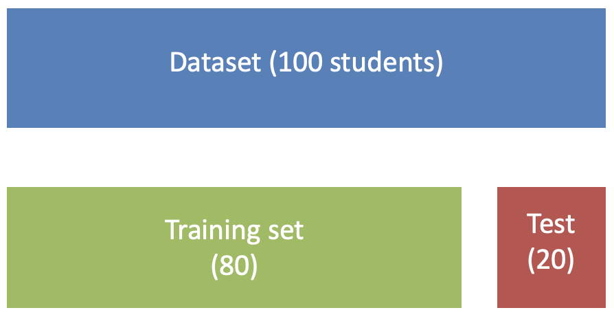

# Part 1: Make a prediction

```{r}
#| echo: false
#| message: false


library(tidyverse)


set.seed(44)

n <- 200

students <- tibble(
  study = runif(n, 0, 12),
  attendance = runif(n, 55, 100)
)

# Probability of passing
students <- students |>
  mutate(
    eta = -6 +
      0.45 * study +
      0.055 * attendance,
    p_pass = plogis(eta),
    pass = rbinom(n, size = 1, prob = p_pass),
    pass = factor(
      pass,
      levels = c(0, 1),
      labels = c("Fail", "Pass")
    )
  )

students <- students |>
mutate(id = row_number())


set.seed(123)

training <- students |>
  slice_sample(n = 80)

validation <- students |>
  filter(!id %in% training$id) |>
  slice_sample(n = 40)

new_student <- tibble(
  study = 4,
  attendance = 77
)

p1 <- ggplot(training,
             aes(x = study, y = attendance, color = pass)) +
  geom_point(size = 3) +
  geom_point(
    data = new_student,
    aes(x = study, y = attendance),
    inherit.aes = FALSE,
    shape = 8,
    size = 5,
    color = "black"
  ) +
  labs(
    x = "Hours studied per week",
    y = "Attendance (%)",
    color = NULL
  ) +
  theme_minimal(base_size = 14)

p1

```

The figure shows reported hours studied per week and attendance rates of
40 students. The points are coloured according to a test result, pass or
fail. The star indicates a *new* student.

1.1) What is your guess: will the *new* student pass or fail?

------------------------------------------------------------------------

1.2) Circle the student nearest to our new student. Use the nearest
student's result to predict the *new* students' result. What is the
prediction? $\hat{y} = ?$

------------------------------------------------------------------------

1.3) Find the $k = 3$ nearest students to our new student. Use the 3
nearest students' result to predict the *new* students' result. What is
the prediction? $\hat{y} = ?$. What is your decision rule (e.g. the
mean? the mode?)?

------------------------------------------------------------------------

<!-- Lecture slides: What is nearest? Euklidean distance and  -->

<!-- is one step along one direction comparable to one step in x-direction? scaling of variables -->

# Part 2: Choosing k

```{r}
#| echo: false
#| message: false
#| fig-width: 12
#| fig-height: 4

library(tidyverse)
library(class)
library(patchwork)


plot_knn <- function(k) {
  
  # Grid covering the predictor space
  grid <- expand_grid(
    study = seq(
      min(training$study),
      max(training$study),
      length.out = 200
    ),
    attendance = seq(
      min(training$attendance),
      max(training$attendance),
      length.out = 200
    )
  )
  
  # KNN prediction for every point in the grid
  grid$prediction <- knn(
    train = training |> select(study, attendance),
    test = grid |> select(study, attendance),
    cl = training$pass,
    k = k
  )
  
  # Plot
  ggplot() +
    geom_raster(
      data = grid,
      aes(
        x = study,
        y = attendance,
        fill = prediction
      ),
      alpha = 0.25
    ) +
    
    geom_point(
      data = training,
      aes(
        x = study,
        y = attendance,
        color = pass
      ),
      size = 2.2
    ) +
    
    labs(
      title = paste0("k = ", k),
      x = "Hours studied",
      y = "Attendance (%)"
    ) +
    
    guides(
      fill = "none",
      color = "none"
    ) +
    
    theme_minimal(base_size = 14)
}


p1 <- plot_knn(1)
p2 <- plot_knn(7)
p3 <- plot_knn(15)

p1 + p2 + p3

```

The figures show what we would predict for new students at any location
in the data domain.

2.1) At what $k$ is the KNN prediction model most flexible? Flexible =
highly adapting to the data that we have seen.

------------------------------------------------------------------------

2.2) Which value of $k$ do you think generalizes best to new data?

------------------------------------------------------------------------

2.3) The data set of 80 students presented above is our *training* data,
i.e. the data we use to create a prediction model. For any new student,
the predicted grade (pass/fail) is given by the $k$ neighbours in the
training data. In KNN classification, our 'prediction model' is based
entirely on the training data and our choice of $k$ (a
'hyperparameter').

Now, we also have access to 40 previously unseen students (both hours
studied, attendance and grade). These students make up our *validation*
data. Error rates on the validation for different choices of $k$ is
given below.

Which value of $k$ would you choose? (This is called hyperparameter
tuning)

------------------------------------------------------------------------

<!-- choosing k = hyperparameter tuning. here the tuning is based on data that was not in the training set -->

2.4) Now that you have chosen $k$ you have a prediction model: a
prediction for a new student is based on it's $k$ nearest neighbors in
the training data. Can you say how good your model is at predicting
grades of *new* students?

------------------------------------------------------------------------

------------------------------------------------------------------------

<!-- No, because we used the 40 students in the validation set to choose k, the validation data has already been used to choose a good model. A final assessment of generalization requires  -->

<!-- a new set of previously unseen students.  -->

```{r}
#| echo: false
#| message: false

library(class)

# Values of k to try
k_values <- c(1, 3, 5, 7, 10, 15, 20)

library(tidyverse)
library(class)

# Values of k to try
k_values <- c(1, 3, 5, 7, 10, 15, 20)

# Calculate validation error for each k
errors <- map_dfr(k_values, function(k) {
  
  pred_validation <- knn(
    train = training |> select(study, attendance),
    test  = validation |> select(study, attendance),
    cl    = training$pass,
    k     = k
  )
  
  tibble(
    k = k,
    error_rate = mean(pred_validation != validation$pass)
  )
})


error_table <- errors |>
  mutate(
    error_rate = scales::percent(error_rate, accuracy = 0.1),
    k = paste0("k = ", k)
  ) |>
  pivot_wider(
    names_from = k,
    values_from = error_rate
  )

knitr::kable(
  error_table,
  align = "c"
)


```

## Part 3: Training, validation and testing

3.1) Fill inn what each dataset is used for:

*Traning data*: \_\_\_\_\_\_\_\_\_\_\_\_\_\_\_\_\_\_\_\_\_\_\_\_\_\_\_

<!-- (training the model based on available data) -->

*Validation data*:
\_\_\_\_\_\_\_\_\_\_\_\_\_\_\_\_\_\_\_\_\_\_\_\_\_\_\_

<!-- (hyperparameter tuning) -->

*Test data*: \_\_\_\_\_\_\_\_\_\_\_\_\_\_\_\_\_\_\_\_\_\_\_\_\_\_\_

<!-- Give an estimate of how well our model predicts -->

3.2) What could we do if we did not have a separate validation set?

------------------------------------------------------------------------

<!-- create from training or validation data, or: CV! -->

<!-- show some cross validation slides -->

## Part 4: Cross validation

4.1) The table below gives error rates based on 5-fold cross validation
on the training data. Which value of $k$ would you choose?

------------------------------------------------------------------------

4.2) Is your choice of $k$ the same of different than before? Why do you
think it differs?

------------------------------------------------------------------------

<!-- discuss in class why different (unstable here with small data) -->

<!-- also give error on new data for both choices of k? -->

```{r}
#| echo: false
#| message: false

library(tidyverse)
library(class)

set.seed(123)

# Create 5 folds
training <- training |>
  mutate(
    fold = sample(rep(1:5, length.out = n()))
  )

# Values of k to compare
k_values <- c(1, 3, 5, 7, 10, 15, 20)

# 5-fold cross-validation
cv_errors <- map_dfr(k_values, function(k) {
  
  fold_errors <- map_dbl(1:5, function(f) {
    
    # Four folds used for training
    train_fold <- training |>
      filter(fold != f)
    
    # Remaining fold used for validation
    validation_fold <- training |>
      filter(fold == f)
    
    # KNN predictions
    pred <- knn(
      train = train_fold |> select(study, attendance),
      test  = validation_fold |> select(study, attendance),
      cl    = train_fold$pass,
      k     = k
    )
    
    # Error rate for this fold
    mean(pred != validation_fold$pass)
  })
  
  tibble(
    k = k,
    cv_error = mean(fold_errors)
  )
})

cv_errors |>
  mutate(
    k = paste0("k = ", k),
    cv_error = scales::percent(cv_error, accuracy = 0.1)
  ) |>
  pivot_wider(
    names_from = k,
    values_from = cv_error
  ) |>
  knitr::kable(
    align = "c"
  )

```

## Cross-validation

**Idea** Train on part of the data and test on data not used for
training


