## Timetable

xxxx

## General topics so far

xxxx

## MNIST Database {.smaller}

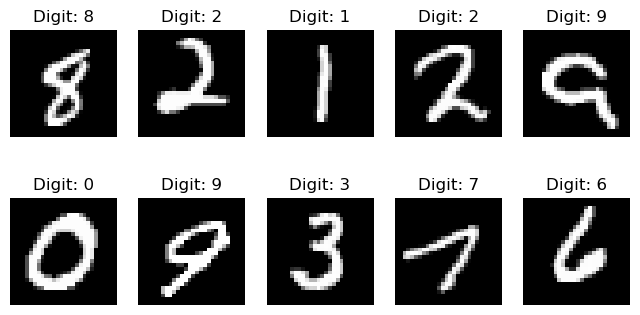

Response **y** (what we want to predict): the true digit (what the person intended to write)

Features / covariates / predictors **X**: "the image" (what the person wrote)

## MNIST Database: Example {.smaller}

y = 8

x = pixel values (0-1) for each of these 28x28 = 784 grid points

First values of x is all zeros because all grid points are black:

x = (0,0,0,0,0,0, ... {something closer to 1}, ...)

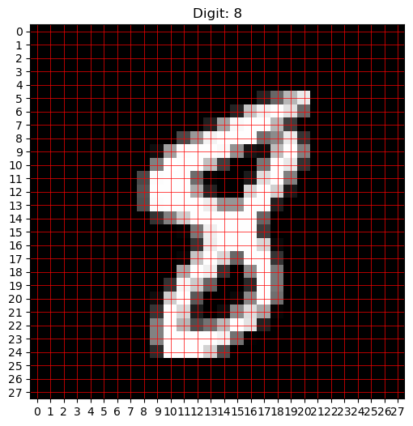

## MNIST Database: Our goal

**Step 1a**: Using training data (7500 images), create **models** that take in an image and return a prediction (0, 1, 2, ..., 9)

**Step 1b**: Evaluate the different models on a validation set (1500 images), and select one

**Step 2**: Final evaluation of the chosen model on a test set (1500 images)

## Multiclass prediction

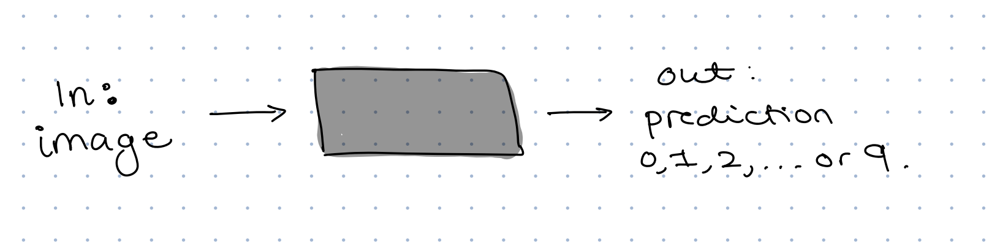

## Multiclass prediction

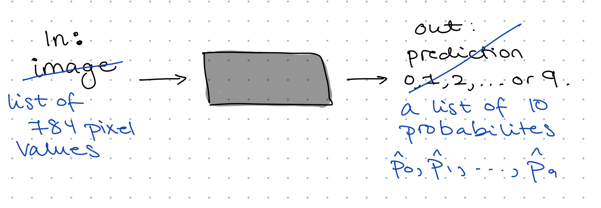

## Multiclass prediction

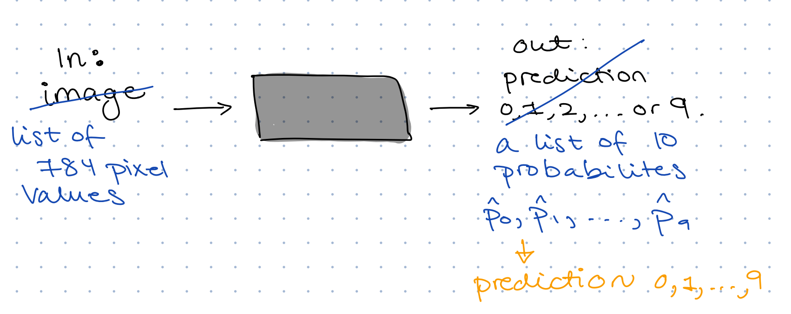

## Multiclass prediction {.smaller}

**How do we go from a list of probabilities to an actual prediction?**

Discuss: What should be our predicted digit if our "black box" returns:

a.  

`Digit:         0   1   2   3   4   5   6   7   8   9`

`Probability: .01 .01 .03 .05 .02 .06 .01 .10 .65 .06`

b.  

`Digit:         0   1   2   3   4   5   6   7   8   9`

`Probability: .03 .02 .05 .29 .02 .27 .03 .04 .18 .07`

<!-- This is up to us, a simple choice is just to take the digit with the maximum probability -->

<!-- We may also choose to NOT give a prediction if none of the probabilities are above some threshold -->

<!-- We may also see this as a probability distribution and sample from it -->

## Multiclass prediction

How do we go from a list of probabilities to an actual prediction?

**Decision rule** for us today:

$$
\widehat{y} = \arg\max_{k \in \{0,\ldots,9\}} \widehat{p}_k
$$

## Multiclass prediction {.smaller}

. . .

Discuss: What is a good "black box" in this case?

Come up with a description both in terms of the $\widehat{p}$-s and $\widehat{y}$.

<!-- Our black box will not actually give 10 probabilities, it will give 10 scores that are not numbers between 0 and 1 and do not sum to one. To make sure we actually get class probabilities we need to do a transformation of these output scores, and the typical choice is the softmax function. -->

<!-- We ultimately want a prediction method that predicts 9 when the intended digit was actually 9 (yhat = y). But we also want a prediction method that gives a high probability for the correct digit.  -->

## Multiclass prediction

What is a good prediction method?

**Loss function** for us today: cross-entropy

If the true digit is $y = 3$ then the loss is:

$$
L = -\log (\widehat{p}_3)
$$

. . .

This loss function rewards putting high probability on the true class ($y = 3$).

. . .

If $\widehat{p}_3 = 0.9$ then $L \approx 0.1$

If $\widehat{p}_3 = 0.3$ then $L \approx 1.2$

<!-- Note: both of the method would give the correct prediciton, but the first is better -->

## Multiclass prediction

What is a good prediction method?

**Loss function** for us today: cross-entropy

If the true digit is $y = 3$ then the loss is:

$$
L = -\log (\widehat{p}_3)
$$

. . .

**Accuracy of predictions**:

$$ 
\text{accuracy} = \frac{\text{number of correct predictions}}{\text{total number of predictions}}
$$

<!-- maybe take accuracy first -->

## Neural networks

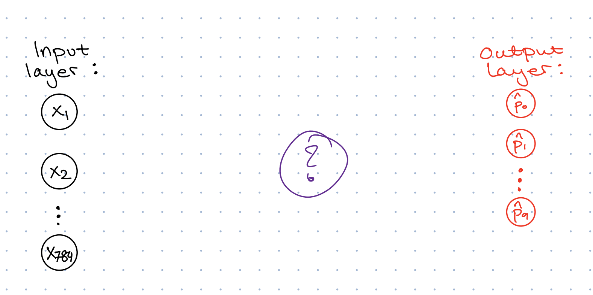

<!-- We want to go from the input layer to the output layer in such a way that the final class probabilities (in the output layer) are accurate (i.e. minimizing the loss function). The question is how? -->

## Neural networks

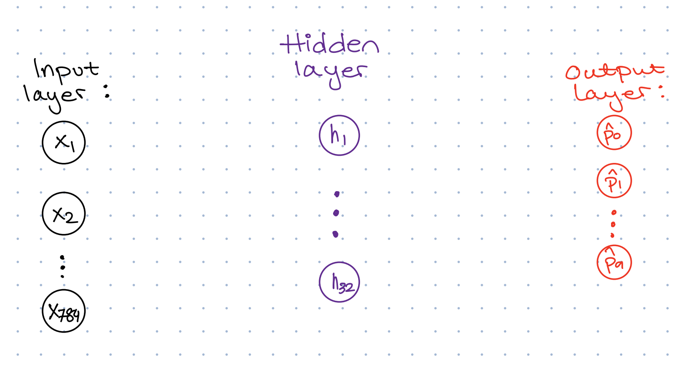

<!-- the numerical values on the input layer is what our image gave us. The numberical values in the output layer are the numbers that we transform into class probabililies. The values in the nodes of the hidden layer will be a function of all the values in the input layer. Lets focus only on the first node in the hidden layer and the value h1.  -->

## Neural networks

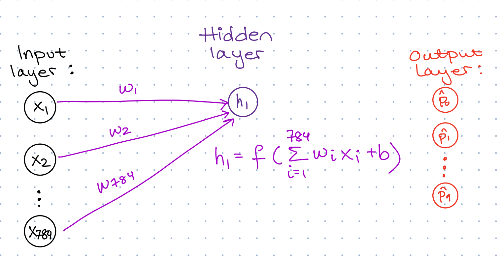

<!-- h1 is a function of the values of the input layer  -->

## Neural networks

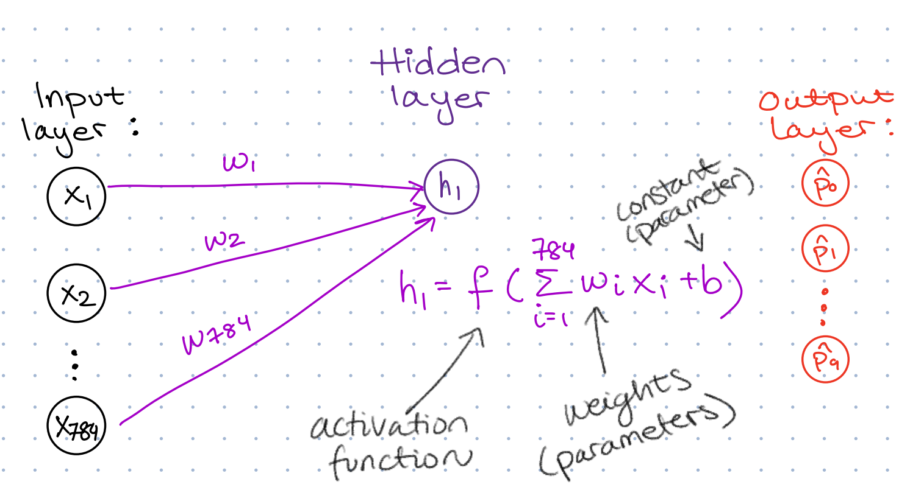

<!-- the w-s are weights. these are unknown, and behave like parameters in statistical models. we will estimate them from the data in our training set. the b is just a constant added to the weighted sum of all the input values. and then that function f is called an activation function. f is not a parameter that we will estimate, but a function that we need to choose when we build the network. It is a bit meaningless if f is a linear function, so the most common choices are non-linear functions -->

## Neural networks

Common activation functions:

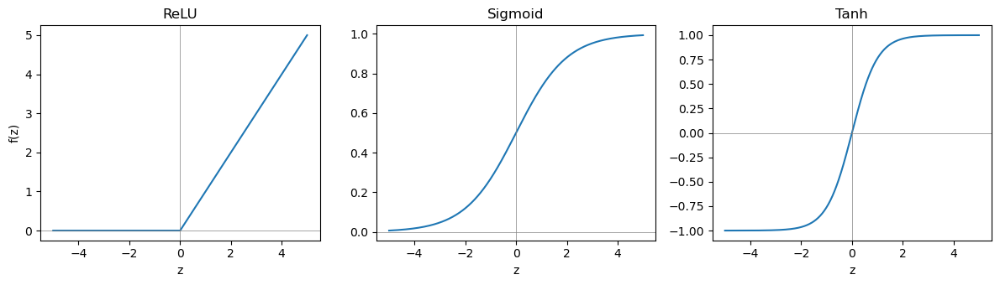

. . .

*We go with ReLU today*

## Neural networks

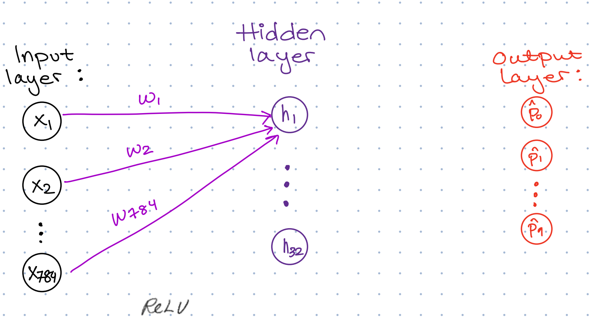

## Neural networks {.smaller}

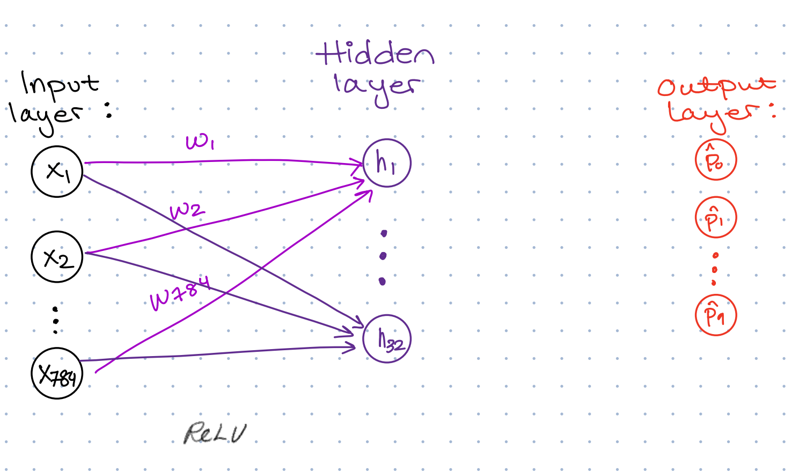

. . .

Discuss: How many unknown parameters have we introduced so far?

. . .

Answer: 784x32 weights (w-s) and 32 offsets (b-s) gives 25 120 unknown parameters

## Neural networks

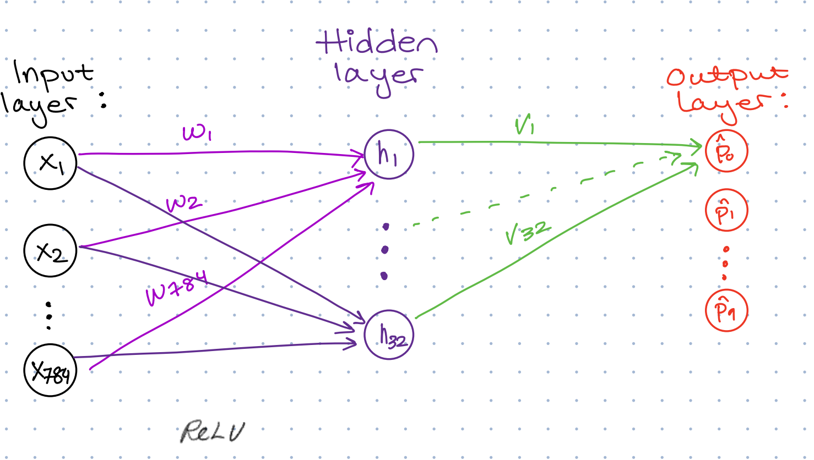

## Neural networks

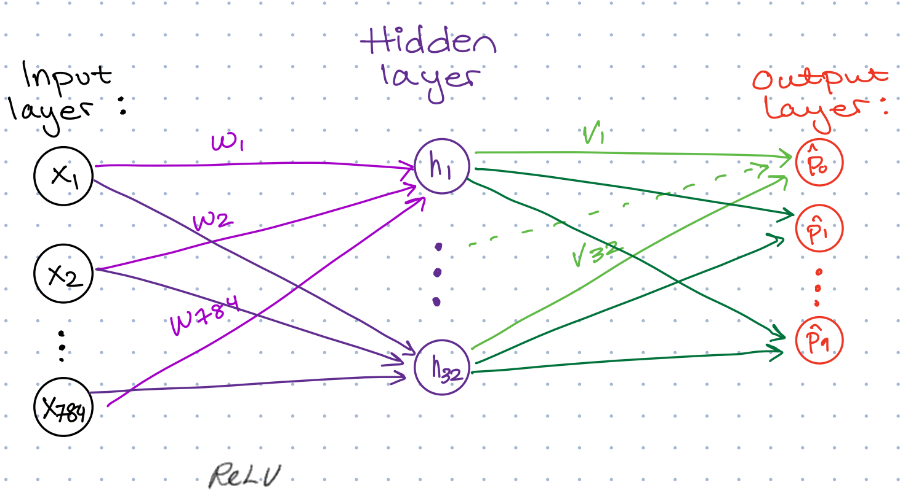

## Neural networks

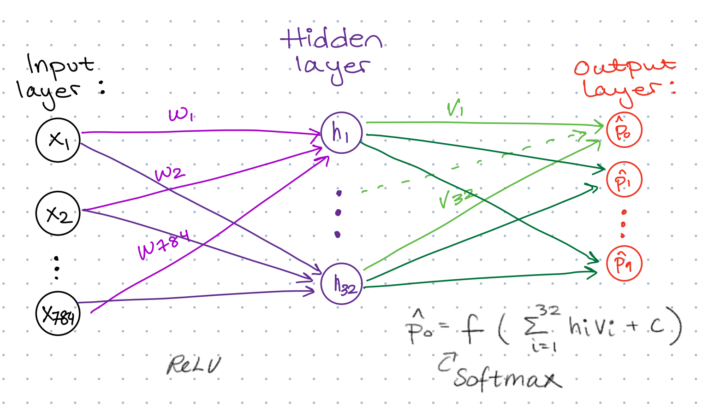

<!-- the function that transforms weighted sums in the numbers to get to the output layer needs -->
<!-- to have some special properties, since the class probabilities should form a discrete probabililty -->
<!-- distribution. we therefore need a function that gives numbers between 0 and 1, and makes sure that they -->
<!-- all sum to one. The softmax activation function does that for us.  -->

## Neural networks {.smaller}

Softmax gives the final class probabilities:

$$
z_k = \sum_i v_i h_i + c_k, k = 0, 1, \ldots, 9
$$

$$
\widehat{p}_k = \frac{e^{z_k}}{\sum_{j=0}^9 e^{z_j}}
$$

## Neural networks {.smaller}

Now we have 25 450 unknown parameters that we must estimate from data by minimizing the loss, using our training data (7500 images (x) and corresponding true digits (y)).

. . .

We start with a random guess, and then try to improve until we are happy with our result or we don't want to spend any  more time (stopping criterion).

## Group work: neural networks

We have seen an example of a neural network with one hidden layer with 32 nodes and the ReLU activation function. In canvas you will find code for this. 

Decide on two other architectures: 

- Adding a second hidden layer?

- Changing the number of nodes in the hidden layer(s)?

- A different activation function? (ReLU, sigmoid or tanh)

Run all three using the test set and calculate the accuracy on the verication set. 
Choose one method and write it down. 

Finally, calculate the accuracy on the test set. 

