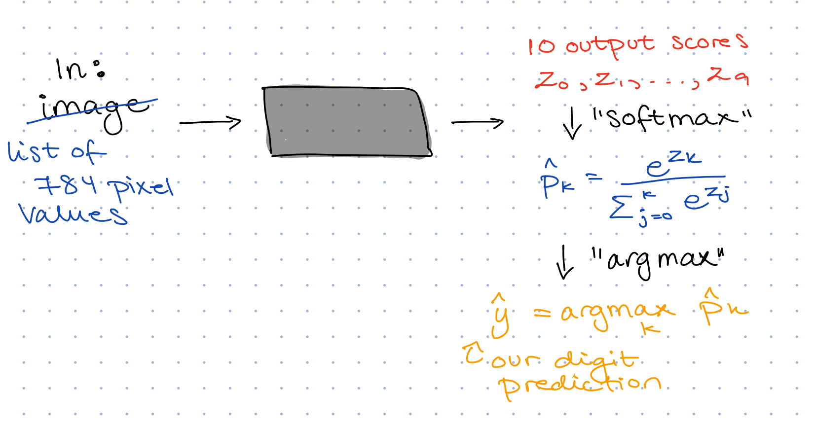

## Timetable

xxxx

## General topics so far

xxxx

## MNIST Database {.smaller}

Response **y** (what we want to predict): the true digit (what the person intended to write)

Features / covariates / predictors **X**: "the image" (what the person wrote)

## MNIST Database: Example {.smaller}

y = 8

x = pixel values (0-1) for each of these 28x28 = 784 grid points

First values of x is all zeros because all grid points are black:

x = (0,0,0,0,0,0, ... {something closer to 1}, ...)

## MNIST Database: Our goal

**Step 1a**: Using training data (7500 images), create **models** that take in an image and return a prediction (0, 1, 2, ..., 9)

**Step 1b**: Evaluate the different models on a validation set (1500 images), and select one

**Step 2**: Final evaluation of the chosen model on a test set (1500 images)

## Multiclass prediction

## Multiclass prediction

## Multiclass prediction

## Multiclass prediction {.smaller}

**Task 1: How do we go from a list of probabilities to an actual prediction?**

Discuss: What should be our predicted digit if our "black box" returns:

a.  

`Digit:         0   1   2   3   4   5   6   7   8   9`

`Probability: .01 .01 .03 .05 .02 .06 .01 .10 .65 .06`

b.  

`Digit:         0   1   2   3   4   5   6   7   8   9`

`Probability: .03 .02 .05 .29 .02 .27 .03 .04 .18 .07`

<!-- This is up to us, a simple choice is just to take the digit with the maximum probability -->

<!-- We may also choose to NOT give a prediction if none of the probabilities are above some threshold -->

<!-- We may also see this as a probability distribution and sample from it -->

## Multiclass prediction {.smaller}

Task 1: How do we go from a list of probabilities to an actual prediction?

**Decision rule** for us today:

$$
\widehat{y} = \arg\max_{k \in \{0,\ldots,9\}} \widehat{p}_k
$$

## Multiclass prediction {.smaller}

<!-- Our black box will not actually give 10 probabilities, it will give 10 scores that are not numbers between 0 and 1 and do not sum to one. To make sure we actually get class probabilities we need to do a transformation of these output scores, and the typical choice is the softmax function. -->
