## Timetable

xxxx

## General topics so far

xxxx

## MNIST Database {.smaller}

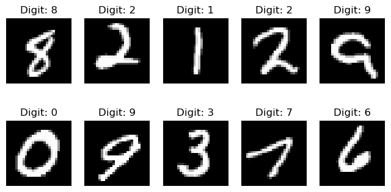

Response **y** (what we want to predict): the true digit (what the person intended to write)

Features / covariates / predictors **X**: "the image" (what the person wrote)

## MNIST Database: Example {.smaller}

y = 8

x = pixel values (0-1) for each of these 28x28 = 784 grid points

First values of x is all zeros because all grid points are black:

x = (0,0,0,0,0,0, ... {something closer to 1}, ...)

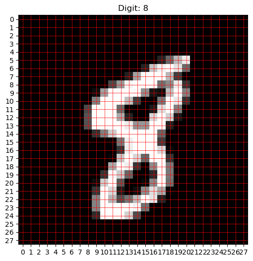

## MNIST Database: Our goal

Using *training* data, 7500 images with digit 'instructions' (X,y), create **prediction models** that take in an image and return a prediction: 0, 1, 2, 4, 5, 6, 7, 8 or 9

. . .

Evaluate the different models on a *validation* set; 1500 images, (X,y), Select the 'best'

. . .

Final evaluation of the chosen model on a *test* set: another set 1500 images, (X,y),

## Multiclass prediction

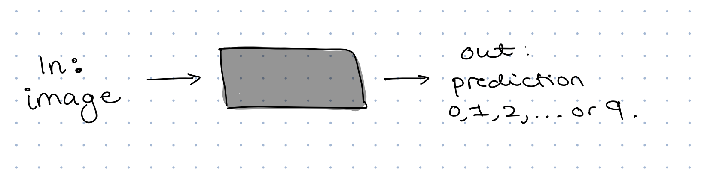

## Multiclass prediction

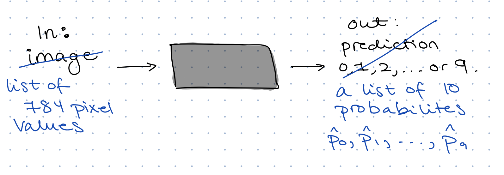

## Multiclass prediction

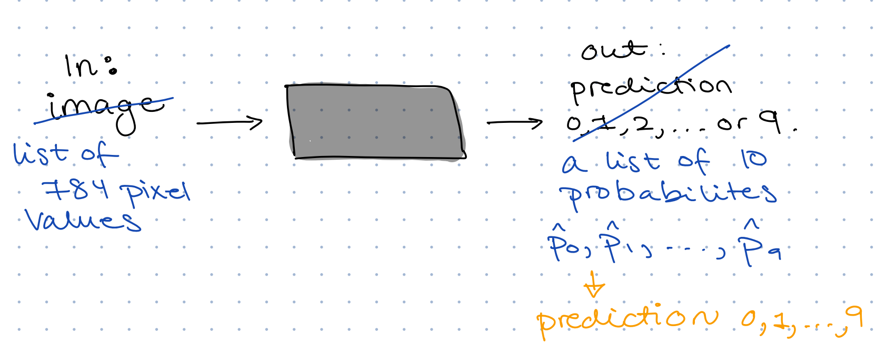

## Multiclass prediction: Group task {.smaller}

**How do we go from a list of probabilities to an actual prediction?**

Discuss: What should be our predicted digit if our "black box" returns:

a.  

`Digit:         0   1   2   3   4   5   6   7   8   9`

`Probability: .01 .01 .03 .05 .02 .06 .01 .10 .65 .06`

b.  

`Digit:         0   1   2   3   4   5   6   7   8   9`

`Probability: .03 .02 .05 .29 .02 .27 .03 .04 .18 .07`

<!-- This is up to us, a simple choice is just to take the digit with the maximum probability -->

<!-- We may also choose to NOT give a prediction if none of the probabilities are above some threshold -->

<!-- We may also see this as a probability distribution and sample from it -->

## Multiclass prediction

How do we go from a list of probabilities to an actual prediction?

**Decision rule** for us today:

$$
\widehat{y} = \arg\max_{k \in \{0,\ldots,9\}} \widehat{p}_k
$$

## Multiclass prediction: Group task {.smaller}

. . .

Discuss: What is a good "black box" in this case (for the MNIST data)?

Come up with a description both in terms of the class probabilities $\widehat{p}$-s and the final digit predictions $\widehat{y}$.

<!-- Our black box will not actually give 10 probabilities, it will give 10 scores that are not numbers between 0 and 1 and do not sum to one. To make sure we actually get class probabilities we need to do a transformation of these output scores, and the typical choice is the softmax function. -->

<!-- We ultimately want a prediction method that predicts 9 when the intended digit was actually 9 (yhat = y). But we also want a prediction method that gives a high probability for the correct digit.  -->

## Multiclass prediction

What is a good prediction method?

**Accuracy of predictions on test data**:

$$ 
\text{accuracy} = \frac{\text{number of correct predictions}}{\text{total number of predictions}}
$$

. . .

But in the model building phase (training data) we will work with minimizing some *loss function*.

## Multiclass prediction

What is a good prediction method?

**Loss function** for us today: cross-entropy

. . .

If the true digit is $y = 3$ then the loss is:

$$
L = -\log (\widehat{p}_3)
$$

. . .

This loss function rewards putting high probability on the true class.

. . .

For example, for $y = 3$:

If $\widehat{p}_3 = 0.9$ then $L \approx 0.1$

If $\widehat{p}_3 = 0.3$ then $L \approx 1.2$

. . .

<!-- Aim: Minimize loss -->

<!-- Note: both of the method would give the correct prediciton, but the first is better -->

## Neural networks

## Neural networks

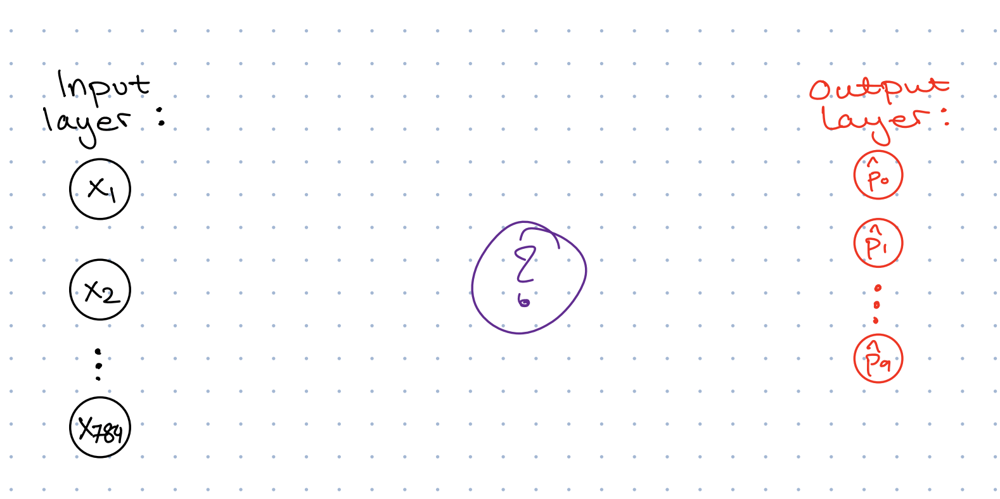

<!-- We want to go from the input layer to the output layer in such a way that the final class probabilities (in the output layer) are accurate (i.e. minimizing the loss function). The question is how? -->

## Neural networks

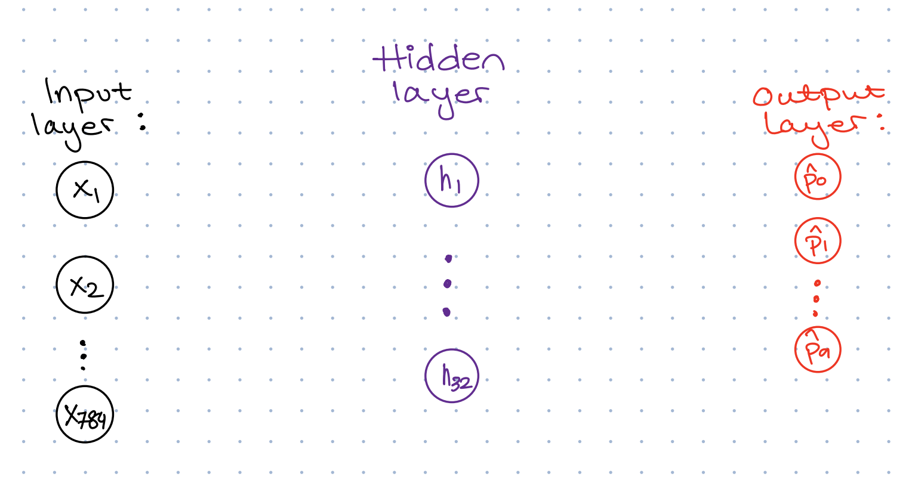

<!-- the numerical values on the input layer is what our image gave us. The numberical values in the output layer are the numbers that we transform into class probabililies. The values in the nodes of the hidden layer will be a function of all the values in the input layer. Lets focus only on the first node in the hidden layer and the value h1.  -->

## Neural networks

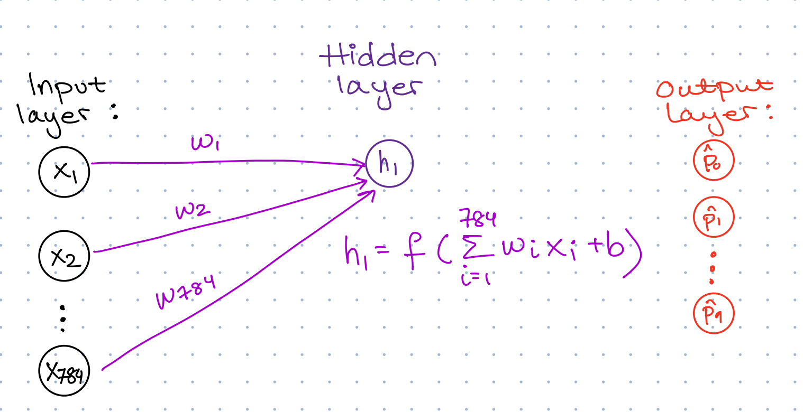

<!-- h1 is a function of the values of the input layer  -->

## Neural networks

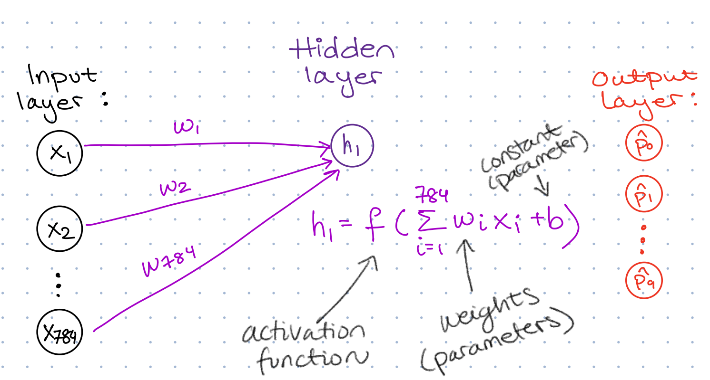

<!-- the w-s are weights. these are unknown, and behave like parameters in statistical models. we will estimate them from the data in our training set. the b is just a constant added to the weighted sum of all the input values. and then that function f is called an activation function. f is not a parameter that we will estimate, but a function that we need to choose when we build the network. It is a bit meaningless if f is a linear function, so the most common choices are non-linear functions -->

## Neural networks

Common activation functions:

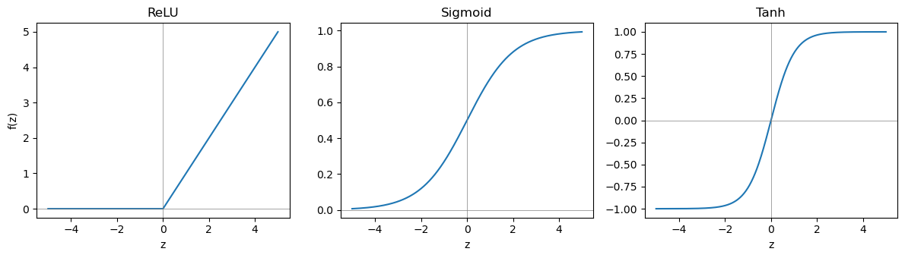

. . .

*We go with ReLU today*

## Neural networks: Group task {.smaller}

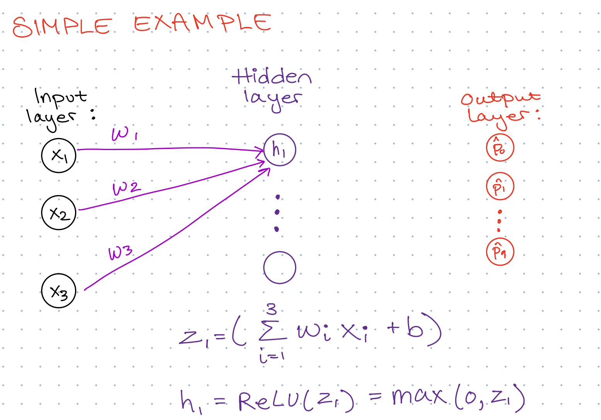

Calculate the value at the first hidden node $h_1$, using input node values:

$$
x_1 = 0.8, \, x_2 = 0.4, \, x_3 = 0.6.
$$

Use the following weights and bias:

$$
w_1 = 1.0, \, w_2 = 0.5, \, w_3 = -0.5, \, b = 0.1.
$$

. . .

Answer: $z_1 = 0.8$, so $h_1 = 0.8$.

## Neural networks

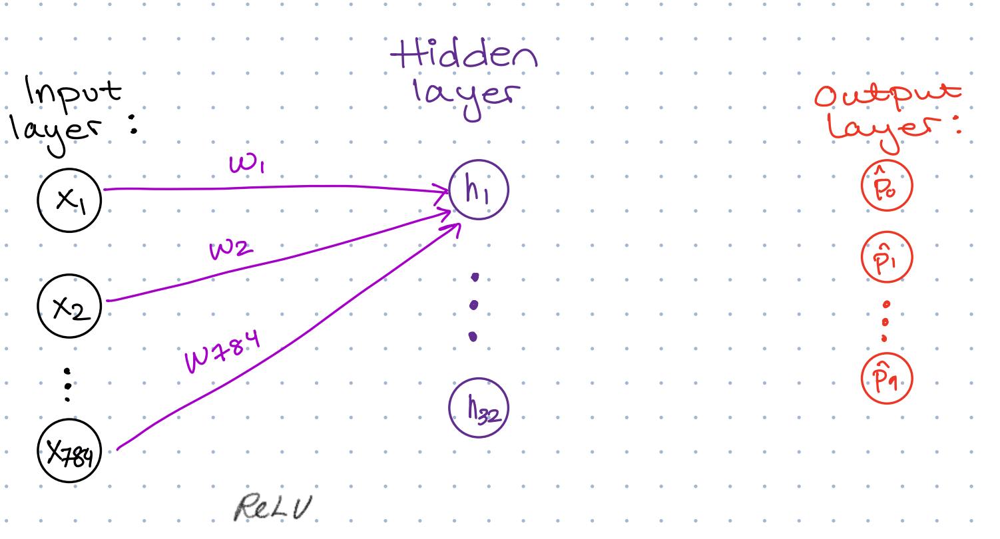

## Neural networks

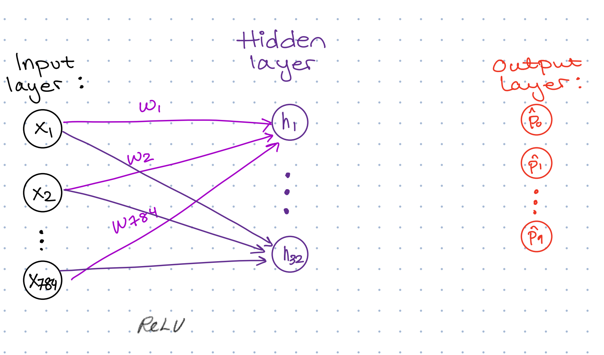

## Neural networks: Group task {.smaller}

Discuss: How many unknown parameters have we introduced so far?

. . .

Answer: 784x32 weights (w-s) and 32 offsets (b-s) gives 25 120 unknown parameters

## Neural networks

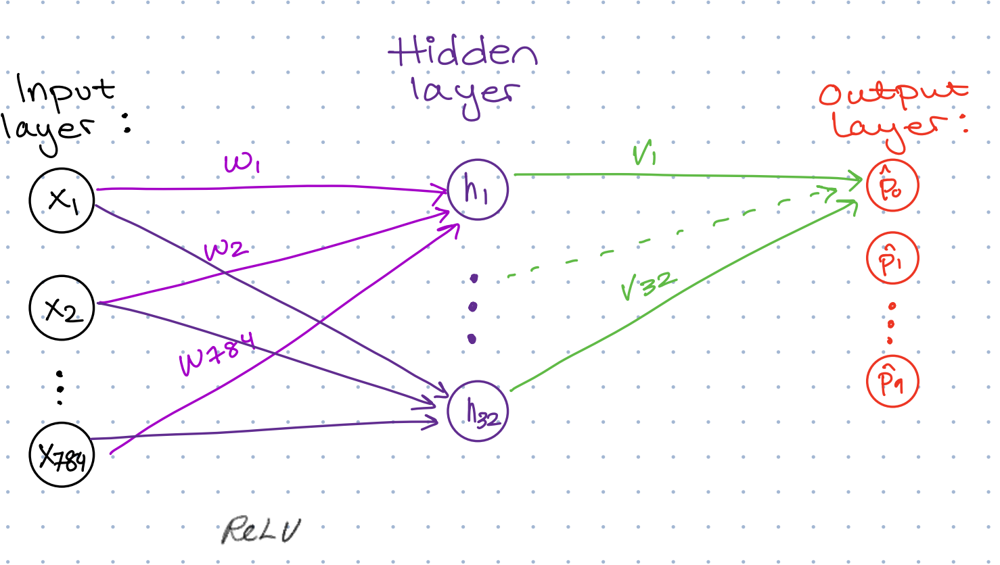

## Neural networks

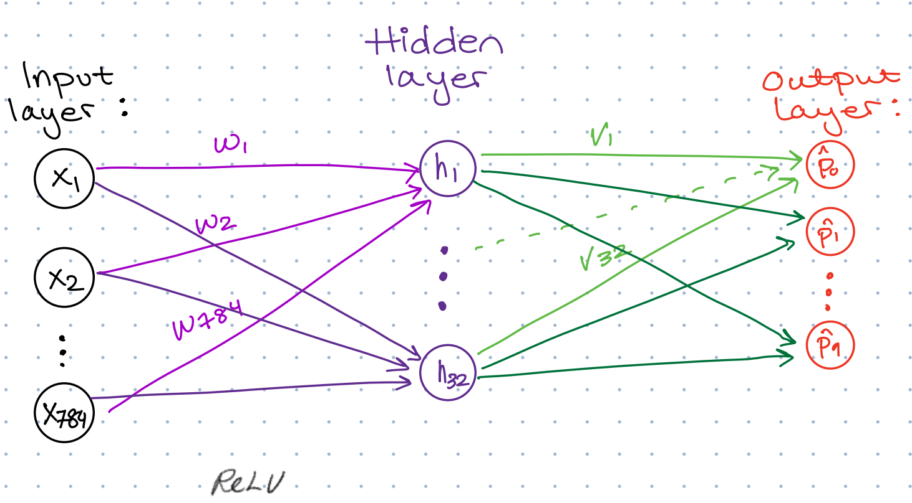

## Neural networks

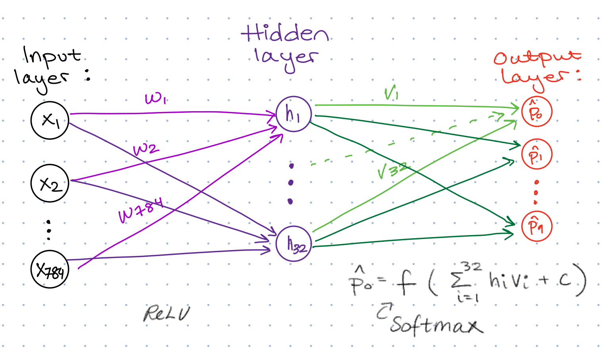

<!-- the function that transforms weighted sums in the numbers to get to the output layer needs -->

<!-- to have some special properties, since the class probabilities should form a discrete probabililty -->

<!-- distribution. we therefore need a function that gives numbers between 0 and 1, and makes sure that they -->

<!-- all sum to one. The softmax activation function does that for us.  -->

## Neural networks {.smaller}

Softmax gives the final class probabilities:

$$
z_k = \sum_i v_i h_i + c_k, \, \, \widehat{p}_k = \frac{e^{z_k}}{\sum_{j=0}^9 e^{z_j}}
$$

## Neural networks: Group task {.smaller}

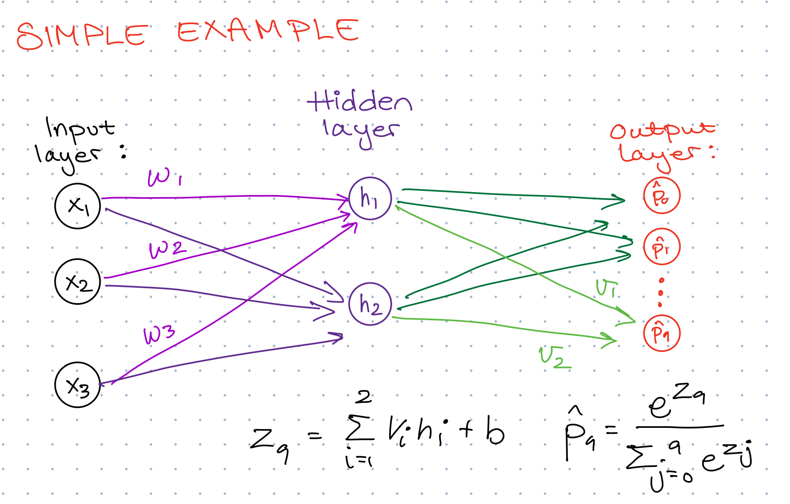

Calculate the class probability at the 10th output node $\widehat{p}_9$, using values given on your handout.

<!-- $$ -->

<!-- h_1 = 0.8, \, h_2 = 0.5. -->

<!-- $$ -->

<!-- Use the following 9 output scores for the digits 0, 1, to 8: -->

<!-- $$ -->

<!-- z_0=0.2, \, z_1=0.5, \, z_2=−0.4, \, z_3=0.8, \, z_4=0.1,  -->

<!-- $$ -->

<!-- $$ -->

<!-- z_5=0.6, \, z_6=−0.2, \, z_7=0.3, \, z_8=0.7. -->

<!-- $$ -->

<!-- Use the following weights and bias: -->

<!-- $$ -->

<!-- v_1 = 1.0, \, v_2 = 0.4, \, b = 0.0. -->

<!-- $$ -->

. . .

Answer: $z_9 = 1.0$ and $\widehat{p}_9 = 0.17$.

## Neural networks {.smaller}

Now we have 25 450 unknown parameters (weights and biases) that we must estimate from our training data (7500 images (x) and corresponding true digits (y)).

## Neural networks: Group task {.smaller}

**How can we find good values of all those weights and biases?**

-   We randomly choose values for our 25 450 parameters.
-   We run some training images through the network and calculate the loss (recall: cross-entropy, rewards putting high probability on the true class).
-   The loss is high. What should we do next?

a.  Choose 25 450 completely new random values and try again.

b.  Change each parameter a little and determine whether increasing or decreasing it would reduce the loss.

c.  Keep the parameters because the network will improve if we simply show it more images.

Which strategy seems most sensible?

## Neural networks: Gradient descent {.smaller}

To find the parameter values that minimize the loss over the training data we want to know which direction to change each parameter to reduce the loss.

. . .

**Gradient descent** (very informally!): 

 - Current parameters
 - Make predictions and calculate loss
 - How would changing each parameter affect the loss?
 - Update/change parameters in a direction that lowers the loss
 - Repeat

. . .

**Backpropagation** is the procedure neural networks use to work out how the parameters contributed to the loss.

. . . 

**Stopping criterion:** When should we stop updating parameters?

 - When we have reached a maximum number of iterations
 - When the loss is no longer improving substantially
 - ...
 
 
 
## Neural networks: Hyperparameter tuning {.smaller}

For our specified network: 

 - 1 hidden layer,
 - 32 hidden nodes,
 - ReLU activation,
 - etc,
 
we use training data to estimate 25 450 unknown parameters (weights and biases). 

. . .

But why 1 hidden layer, 32 nodes and ReLU? These are *hyperparameters*, and we might want to consider other choices (architectures). 

. . .

For each architecture, we train the network using the training data.

Then using *validation data* we compare the trained models and make modelling choices.

## Group work: neural networks

We have seen an example of a neural network with one hidden layer with 32 nodes and the ReLU activation function. In canvas you will find code for this.

Decide on two other architectures:

-   Adding a second hidden layer?

-   Changing the number of nodes in the hidden layer(s)?

-   A different activation function? (ReLU, sigmoid or tanh)

Run all three using the test set and calculate the accuracy on the verication set. Choose one method and write it down.

Finally, calculate the accuracy on the test set.
