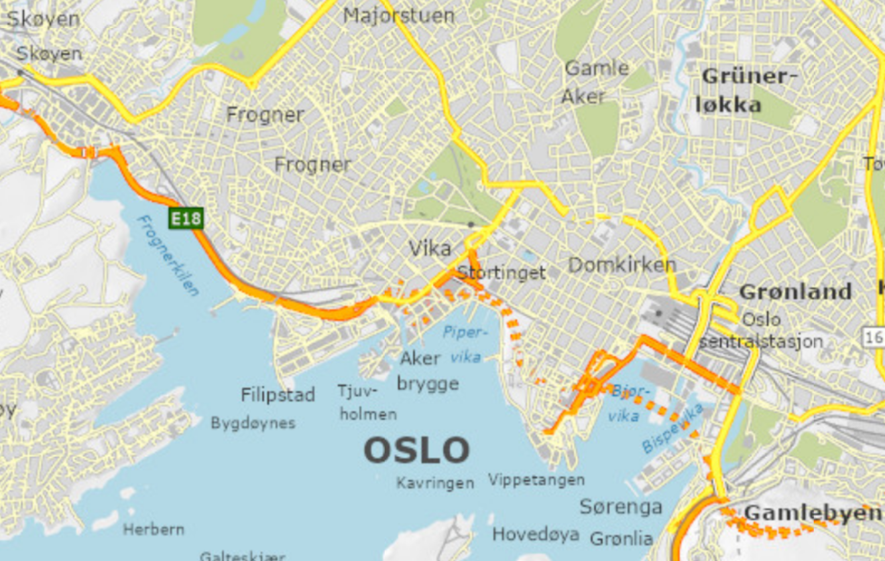

## Portfolio assessment

-   8 smaller activities, participation (hand-in) counts 5 points each, but at most 30 points. **We have completed 4 of these**.

-   Projects (graded by us) account for the remaining (up to) 70 points

-   Project 1: Approx 30 points

-   Project 2: Approx 40 points (slightly bigger)

## Time table {.smaller}

| Week | Date        | Planned Activity |      Delivery       |
|------|:------------|-----------------:|:-------------------:|
| *39* | *Wed 23.09* |      *Project 1* | (Part 1 presented)  |
|      | *Fri 25.09* |      *Project 1* |   *First Hand-in*   |
| *40* | *Wed 30.09* |      *Project 1* | (Part 2 presented)  |
|      | *Fri 02.10* |      *Project 1* |         *-*         |
| *41* | *Wed 07.10* |      *Project 1* |   *Final Hand-in*   |

**Note:** The groups will manage the work done and participation in/outside class. An entire group cannot be absent without agreement with the lecturers.

## Project 1: About the data

The dataset contains data from two traffic monitoring points in Frogner, Oslo: one monitoring motor vehicles and one monitoring bicycles. You will also be given a weather data from a nearby location.

The data are provided in the same structure and format as when they are downloaded directly from Statens Vegvesen. The traffic data cover the period from 1 January 2026 to 1 June 2026.

## Project 1: Overall aim

The overall aim is modelling of traffic load (number of vehicles per 30 minutes) using the two different data sources (traffic monitoring and weather).

You will use multiple linear regression and can apply all variations of this that you have learnt so far, or add new elements.

Before you can arrive at a suitable model, you will have to make several choices. Some choices are quite free (no right / wrong), but for most problems there are more and less reasonable choices to make.

## Grading

In general, we are looking for both **correctness** in use of methods, and your **understanding/reflections** regarding the data, you choices and your results.

**AI-use**: We expect you to take advantage of all available resources, but the challenge is to use them in a good way.

**Documenting progress**: One of the hand-ins for the project is a (brief) timeline. At the end of *each* session you will make a short reflective note, including

1.  Date and group members present
2.  Main confusion / frustration
3.  Main breakthrough
4.  Most useful AI-output of the session
5.  A list of choices made (and why)

## Project 1: Part 1

*Today (Wednesday) and Friday*

**Getting to know the data, data cleaning, and prepare for modelling**

The data has not been cleaned for you, and you need to e.g. handle missing data and make sure columns of numbers are not represented as characters. Your goal is to model total traffic (both directions combined, excluding bicycles). Make sure to filter out the relevant rows.

Visualize the traffic load.

Merge the traffic data with the weather data.

**Choice (example):** How will you deal with different time resolutions when you combine the two data sources?

## Project 1: Part 1 Hand-In

Timeline (sessions 1 and 2) and answers to the following:

1\) Decide on an aim for your model of total traffic, what do you as a group want to strive for? How will you balance interpretability (usually few covariates / features) and model fit (the models ability to explain variability in the outcome)?

2\) Select weather variables, explain your choice and discuss how they might be added to your model (linear effect, transformations, categorical variables, splines?)

3\) Create temporal variables based on the date and time of the traffic counts. Which variables did you create, and how will you try entering them into your regression model?
