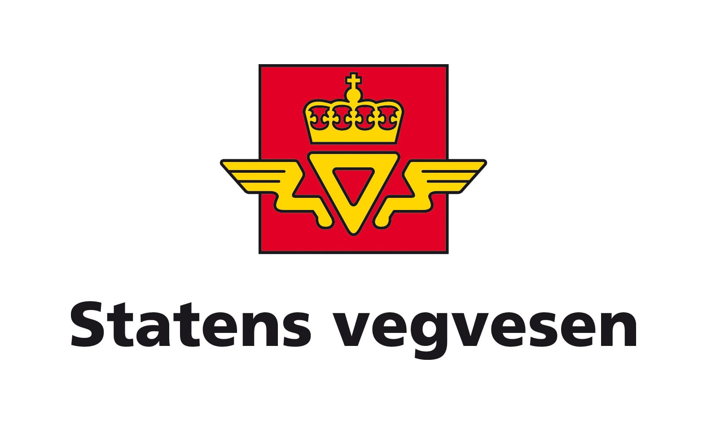

## First: Create Groups in Canvas

Find the desk with your group number: *This is your group for the entire project*

\- Log into Canvas

\- Click on People on the right side of the page

\- Click on Group

\- Scroll to the group with the number on your desk and enroll yourself in the group

**Introduce yourselves to the other group members :)**

## Results from first course survey ("reference group")

-   88% responded "*I usually learn something from discussing with the other students*"

. . .

-   Many find it easy to get to know new group members, but quite a few also find it a bit difficult.

-   For the project: take time to introduce yourselves, and to hear everyone's thoughts and ideas. Not all students jump into a discussion voluntarily.

## Working in project groups {.smaller}

For the project, you are freer than before to manage your work.

Here are some tips based on what we have observed so far:

1.  Have one person dedicated to keep track of time, so that you don't spend too much time on one task

2.  Vary between different work modes:

    1.  All students work individually with AI and coding to generate ideas

    2.  Only 1 student with a PC and sharing the screen

    3.  No PC - only discussions

. . .

Why? When you are all lost behind your screen you sometimes get extremely inefficient / unfocused.

## Time table {.smaller}

| Week | Date        | Planned Activity |       Delivery       |
|------|:------------|-----------------:|:--------------------:|
| *39* | *Wed 23.09* |      *Project 1* |  (Part 1 presented)  |
|      | *Fri 25.09* |      *Project 1* |   *First Hand-in*    |
| *40* | *Wed 30.09* |      *Project 1* |  (Part 2 presented)  |
|      | *Fri 02.10* |      *Project 1* |         *-*          |
| *41* | *Wed 07.10* |      *Project 1* |   *Final Hand-in*    |
|      | *Fri 09.10* |              TBD | Assignment, 5 points |

**Note 1:** The groups will manage the work done and participation in/outside class. An entire group cannot be absent without agreement with the lecturers.

. . .

**Note 2:** If we see it necessary for your work, the time table can change. Give us feedback!

. . .

**Note 3:** No lecturing other than general information at the **start of each session** (be on time!). And we will not disturb you (like we usually do), now it is up to you to ask us for help.

## Portfolio assessment

-   8 smaller activities, participation (hand-in) counts 5 points each, but at most 30 points. **We have completed 4 of these**.

-   Projects (graded by us) account for the remaining (up to) 70 points

-   Project 1: 30 points

-   Project 2: 40 points

## Project 1: About the data

The project data is given to us by a statistician at Statens Vegvesen (The Norwegian Public Roads Administration), Emma Skarstein.

## Project 1: About the data {.smaller}

The data contains data from two traffic monitoring points in Frogner, Oslo: one monitoring motor vehicles and one monitoring bicycles. You will also be given weather data from a nearby location.

. . .

The data are provided in the original format. The traffic data cover the period from 1 January 2026 to 1 June 2026.

. . .

Your job is to work as a data science team, finding out how the data can be used, i.e. gaining knowledge and value from data.

## Project 1: Overall aim

Your overall aim is modelling of traffic load (number of vehicles per 1 hour) using two different data sources (traffic monitoring and weather).

. . .

You will use multiple linear regression and can apply all variations of this that you have learnt so far (transformations, categorical variables, interactions), or add new elements.

. . .

Before you can arrive at a suitable model, you will have to make several choices. Some choices are up to your imagination (no right/wrong), but for most problems there are more and less reasonable choices to make.

## Grading {.smaller}

In general, we are looking for both **correctness** in use of methods, and your **understanding/reflections** regarding the data, you choices and your results.

**AI-use**: We expect you to take advantage of all available resources, but the challenge is to use them in a good way. (Your teachers and teaching assistants are also a resource...)

. . .

**Documenting progress**: One of the final hand-ins for the project is a (brief) timeline. At the end of *each* session you will make a short reflective note, including

1.  Date, group members present and how you collaborated
2.  Main confusion / frustration
3.  Main breakthrough
4.  Most useful AI-output of the session
5.  A list of choices made (and why)

## Project 1: Part 1

*Today (Wednesday) and Friday*

**Getting to know the data, data cleaning, and prepare for modelling**

You will get the Part 1 project description on paper and in Canvas. *Read carefully.*

Todays' reflection note is on paper, hand in to teacher before you leave (we give them back later, take a picture so that you have a copy).

**Note:** We will not disturb you in the same way as we have done before, it is now up to you to ask us questions.
