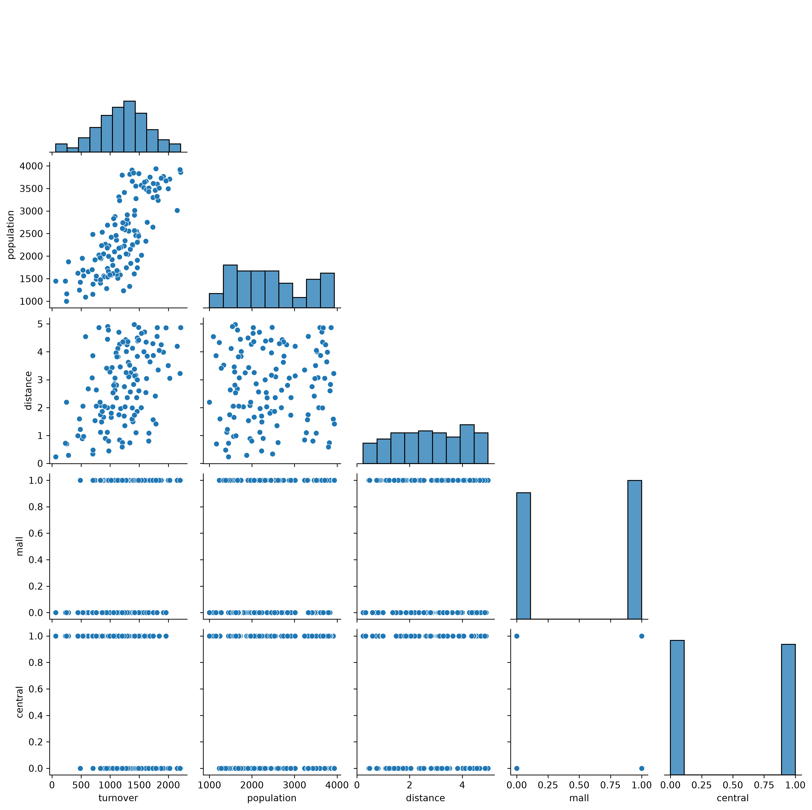
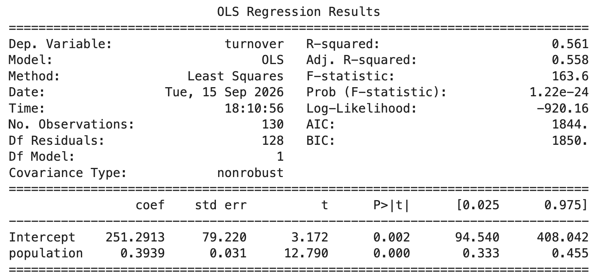
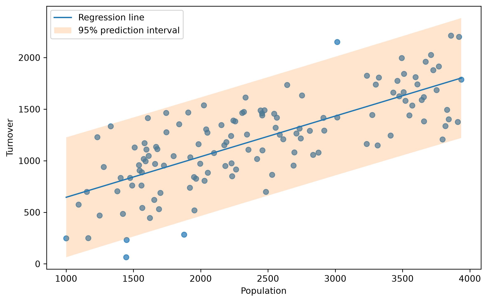
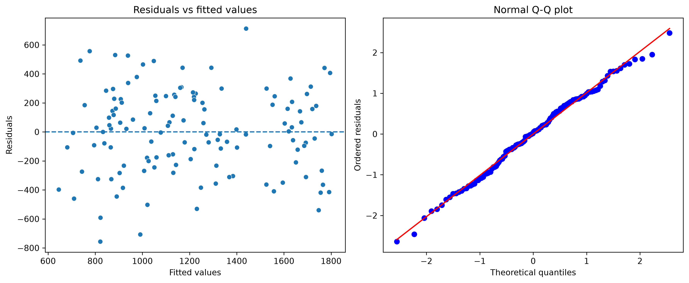
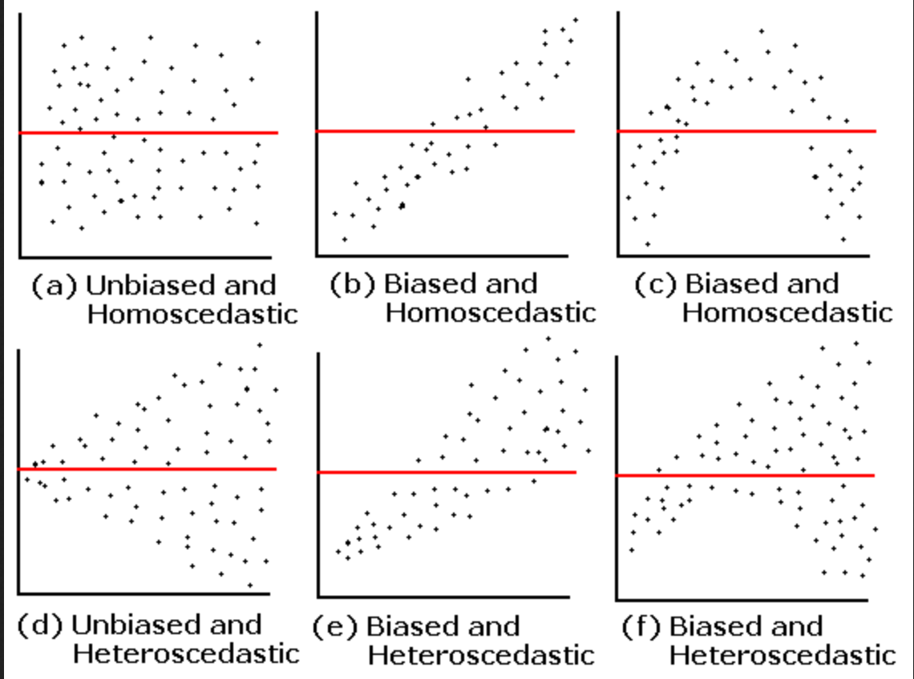
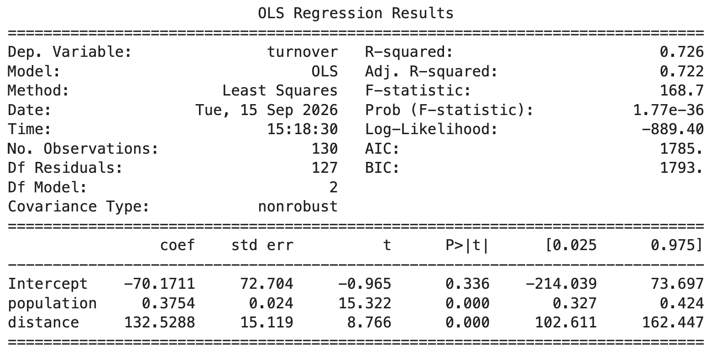
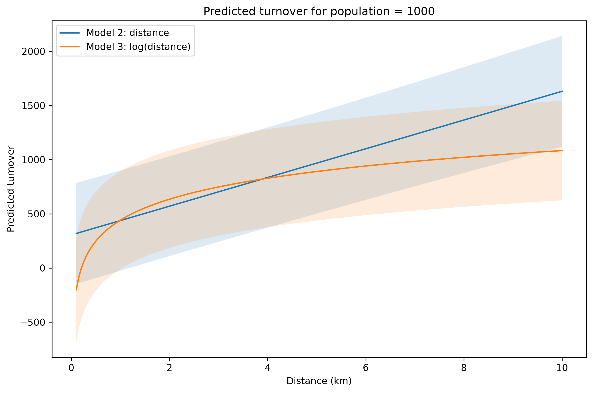
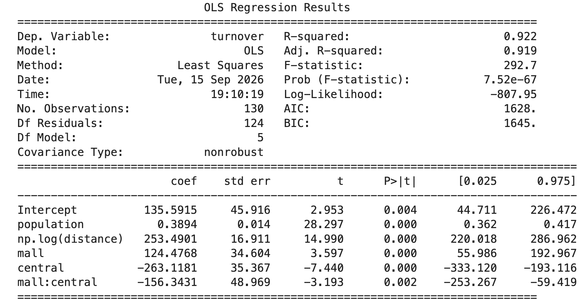

## Multiple Linear Regression {.smaller}

Learning goals for today:

-   Fit a linear regression model and interpret the output (result)

-   Evaluate the model using $R^2$ and residual plots

-   Build the model using

    -   multiple covariates
    -   transformations
    -   categorical variables
    -   interactions

-   Make predictions from the model, including prediction uncertainty

## Our Data {.smaller}

Today we will work with the (simulated) *groceries.csv* dataset.

Here you find the following variables:

-   **turnover**: Weekly turnover (measured in 1000 NOK).
-   **population**: Number of people living within 1 km of the store.
-   **distance**: Distance (in km) to the nearest competing grocery store.
-   **central**: Indicator variable equal to 1 if the store is located in a city center, 0 otherwise.
-   **mall**: Indicator variable equal to 1 if the store lies within a mall (shopping center), 0 otherwise.

```{r}
library(car)
library(ggplot2)
library(GGally)
library(patchwork)
library(tidyverse)
rm(list = ls())
groceries = read.csv("groceries.csv")

model0 = lm(turnover ~ population, data = groceries)

```

Our interest lies in predicting the weekly turnover based on the other available data.

## Today's exercise {.smaller}

-   Log into Canvas

-   Find the assignment **Regression Week 36** (no deliverables, practice only)

-   You'll find two files:

    1.  Data: `groceries.csv`
    2.  Instructions: `lin_reg_week38.ipynb`

-   Download both of them

-   Log into NTNU JupyterHub <https://jupyter.ntnu.no/>

-   Drag the files into the workspace. Here you find code for some of todays tasks. The remaining tasks we expect you to complete using AI.

## Exploratory analysis

**Python:** Complete `TASK 1: Visualize the data`

**Discuss:** What do you notice from the plot? Which quantities appear to influence the turnover?

## Exploratory analysis



## Simple linear regression

**Model 1:**

$$
\text{turnover} = \beta_0 + \beta_1 \text{population} + \epsilon
$$

**Python:** Complete `TASK 2: Simple linear regression` where you fit a linear regression model with *population* as the only covariate.

**Discuss:**

-   How do you interpret the two estimated parameters?
-   One of the outputs of the model is the $R^2$ quantity, can you explain what it is?

## Simple linear regression {.smaller}



-   The intercept is the predicted turnover when population = 0. Is that a realistic situation for these stores?
-   For each extra person living within 1 km from the shop, the weekly turnover increases by approx 390 NOK.

## Simple linear regression

**Model 1:**

$$
\text{turnover} = \beta_0 + \beta_1 \text{population} + \epsilon
$$

**Python:** Complete `TASK 3: Visualize the model, including prediction interval`

**Discuss:** What do you notice by looking at the fitted regression line, the data points and the prediction interval? What is the predicted turnover (with uncertainty) for a *new* shop built in an area where 2000 people live?

## Simple linear regression



```         
Predicted turnover 2000 people: 1039 [464, 1614]
```

```{r}

# Create values of population over the range of your data
newdata <- data.frame(
  population = seq(
    min(groceries$population),
    max(groceries$population),
    length.out = 100
  )
)

# Get fitted values and prediction intervals
pred <- predict(model0, newdata = newdata, interval = "prediction")

# Add predictions to newdata
newdata <- cbind(newdata, as.data.frame(pred))

# # Plot
# ggplot() +
#   geom_point(data = groceries, aes(x = population, y = turnover)) +
#   geom_ribbon(
#     data = newdata,
#     aes(x = population, ymin = lwr, ymax = upr),
#     alpha = 0.2
#   ) +
#   geom_line(
#     data = newdata,
#     aes(x = population, y = fit),
#     linewidth = 1
#   ) +
#   labs(
#     x = "Population",
#     y = "Turnover"
#   ) +
#   theme_minimal()
```

```{r}

pred <- predict(model0, newdata = data.frame(population = 2000), interval = "prediction")
# pred
```

## Simple linear regression: residuals {.smaller}

**Model 1:**

$$
\text{turnover} = \beta_0 + \beta_1 \text{population} + \epsilon
$$

**Definition:** The residuals, in this case, are defined as the *observed* minus the *predicted* turnover

**Python:** Do `TASK 4: Residuals` where you are given code to compute residuals and standardized residuals, and plotting two common diagnostic plots.

**Discuss:** What do you remember from a basic statistics course about these plots? What are we looking for?

How are the residuals related to the mathematical model formulation, and how should the residuals behave?

## Simple linear regression: residuals



```{r}
res = data.frame(residuals = residuals(model0), 
                 pred = predict(newdata = groceries, model0),
                 obs = groceries$turnover,
                 pop = groceries$population,
                 ii = 1:dim(groceries)[1])

p1 = res %>% ggplot() + geom_point(aes(ii, residuals)) + ggtitle("Residuals")
p2 = res %>% ggplot() + geom_point(aes(pred, residuals)) + ggtitle("Residuals vs Predict")


p3 <- ggplot(res, aes(sample = residuals))
p3 = p3 + stat_qq() + stat_qq_line()+xlab("Theoretical Quantiles") + ylab("Sample Quantiles") +
  ggtitle("QQ plot")
# p1+p2 + p3 + plot_layout(ncol= 2)

```

## Model assumption and residuals {.smaller}

Remember: $y_i = \beta_0 + \beta_1 x_i + \epsilon_i$ where

-   $\beta_0 + \beta_1 x_i$ is the **systematic part**
-   $\epsilon_i$ is the **random error**, with $\epsilon_i \sim N(0,\sigma^2)$

The key assumption we check with residuals is:

**The errors should behave like (Gaussian) random noise.**

A residual plot should therefore show:

-   Random scatter around 0
-   Roughly the same amount of spread across the range
-   No obvious curve or other pattern
-   No "funnel" shape

## What we don't want to see ...



## Improving our regression model {.smaller}

We will now add the *distance* covariate to the model

**Model 2:**

$$
\text{turnover} = \beta_0 + \beta_1 \text{population} + \beta_2 \text{distance} + \epsilon
$$

**Python:** Do `TASK 5: Extend the model`, use AI if needed, to add the extra covariate.

**Discuss:**

-   How do you interpret the estimated parameters?

-   What happened to the parameter for population? Why?

-   Compare adjusted $R^2$ between Model 1 and Model 2, do you see an improvement?

## Improving our regression model

Model 1: Only population


## Improving our regression model

Model 2: Population and distance



```{r}
model1 = lm(turnover ~ population + distance, data = groceries)
model1b = lm(turnover ~ population + log(distance), data = groceries)
```

```{r}
#summary(model0)
```

```{r}
#summary(model1)
```

## Transforming covariates {.smaller}

We will now modify how the *distance* covariate enters the model

**Model 3:**

$$
\text{turnover} = \beta_0 + \beta_1 \text{population} + \beta_2 \text{log(distance)} + \epsilon
$$

**Discuss 1:** Why would this model make sense? For example, should increasing distance from 1 → 2 km have the same effect as increasing it from 8 → 9 km?

**Python:** Do `TASK 6: Covariate transformation`, use AI if needed, to add the log transform of distance as a covariate. Plot the predicted turnover for both models (model 2 and model 3) when the population is 1000 and the distance ranges from 0.1 to 10 km (you can add prediction uncertainties).

**Discuss 2:** What do you notice from these plots?

## Transforming covariates



```{r}
newdata = data.frame(distance  = seq(0.1, 10, 0.01), population = 1000)
pred1 = data.frame(predict(model1, newdata, interval = "pred" )) %>%
  mutate(distance = newdata$distance)
pred2 = data.frame(predict(model1b, newdata, interval = "pred")) %>%
  mutate(distance = newdata$distance)


#ggplot() + geom_ribbon(data = pred1, aes(x = distance, ymin = lwr, ymax = upr), alpha = 0.5)+ 
#  geom_line(data = pred1, aes(x = distance,y = fit)) + 
#  geom_ribbon(data = pred2, aes(x = distance, ymin = lwr, ymax = upr), alpha = 0.5, fill = "red") +
#  geom_line(data = pred2, aes(x = distance,y = fit), color ="red") 

```

## Transforming covariates

In general, a covariate can enter into our model in many ways using some transformation, i.e:

$$
y_i = \beta_0 + \beta_1 f(x_i) + \epsilon_i
$$

This adds a lot of flexibility to the model.

## Adding categorical covariates

We now want to check weather being in a mall or being in the city center has also an effect on the turnover.

**Model 4:**

$$
\text{turnover} = \beta_0 + \beta_1 \text{population} + \beta_2 \text{log(distance)} + \beta_3 \text{mall} + \beta_4 \text{center} + \epsilon
$$

**Python:** Do `TASK 7: Add categorical covariates`, use AI if needed.

**Discuss 2:** How do you interpret the new parameters?

## Adding categorical covariates {.smaller}

```{r}
model2 = lm(turnover ~ population + log(distance) + mall + central, data = groceries)
#summary(model2)
```


-   If the store is in a mall it will, all other variable being equal, earn ca 46 000 NOK more per week compared to one that is not in a mall. This effect does not seem to be significant.

-   Holding population, distance and mall status constant, the model predicts that city-centre stores have approximately 345 000 NOK lower weekly turnover than stores outside the city centre.

## Categorical variables - encoding {.smaller}

-   Because mall and central are coded 0/1, the model compares:

    -   mall = 1 vs mall = 0
    -   central = 1 vs central = 0

-   The coefficients for mall and central describe the difference relative to the 0 category (in this case "not in the mall" and "not in the center"), while keeping population and distance fixed.

-   The same principle applies for variables with multiple categories, one cetagory is the reference one, the effects are differences from the reference category.

## Adding categorical covariates {.smaller}

**Model 4:**

$$
\text{turnover} = \beta_0 + \beta_1 \text{population} + \beta_2 \text{log(distance)} + \beta_3 \text{mall} + \beta_4 \text{center} + \epsilon
$$

**Python:** Continue on `TASK 7: Add categorical covariates`, use AI if needed.

-   Plot the predicted turnover for two shops, both in a mall, one in the center and one not, with population 1000 and distances to the nearest competitor ranging from 0.1 to 5 km (no intervals).
-   Add **confidence intervals** to the plot
-   Add **prediction intervals** to the plot

**Discuss:** What is the difference between these two types of intervals?

## Adding categorical covariates

Predictions:


## Adding categorical covariates

Confidence intervals:


## Adding categorical covariates

Prediction intervals:


## Interactions {.smaller}

What happens if a shop is in a mall *and* in the city center?

**Model 5:**

$$
\text{turnover} = \beta_0 + \beta_1 \text{population} + \beta_2 \text{log(distance)} 
$$ 

$$
+ \beta_3 \text{mall} + \beta_4 \text{center} + \beta_5 \text{mall} \cdot \text{center} + \epsilon
$$

**Python:** Do `TASK 8: Add interaction`, use AI if needed, to fit a model where *mall* and *central* interact with each other.

**Discuss:** If population and distance are the same, what is the predicted turnover for a shop that is in a mall in the city center compared with a shop that is in the center but outside a mall?

## Interactions



```{r}
model3 = lm(turnover ~ population + log(distance) + mall * central, data = groceries)
# summary(model3)
```

## Predictions and decision making {.smaller}

You are building a new store and have two locations to consider. Both are outside of a city center and have about 2500 inhabitants within the nearest 1 km.

The first location has a distance of 2 km to the nearest competitor, and is not within a mall. The second location is only 0.5 km from the nearest competitor, but is within a mall.

What is predicted turnover at the two locations? Calculate 95% prediction intervals. Is it clear, from the model, which location you should prefer?

Use our final model with interactions to evaluate this.

## Predictions and decision making {.smaller}


```{r}
ndata = data.frame(distance = c(2, 0.5),
                   population = c(2500,2500),
                   mall = c(0,1),
                   central = c(0,0))
#predict(model2, ndata, interval = "pred")
```
