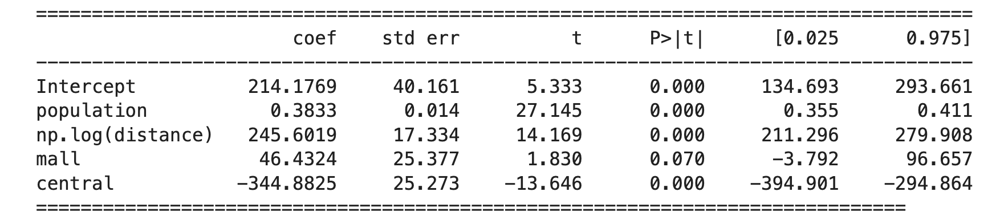
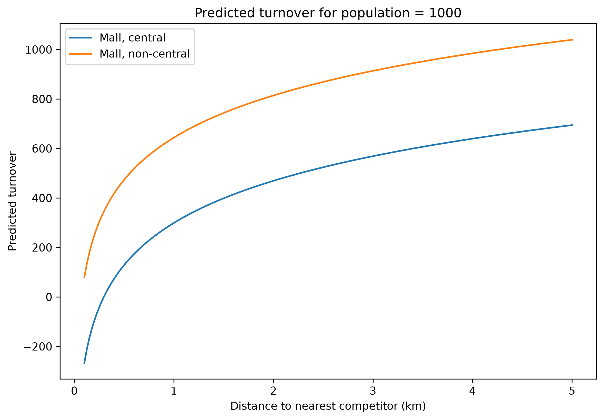
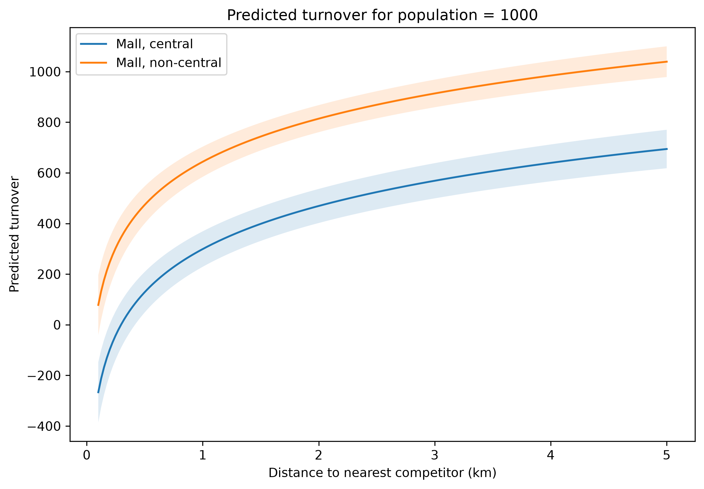
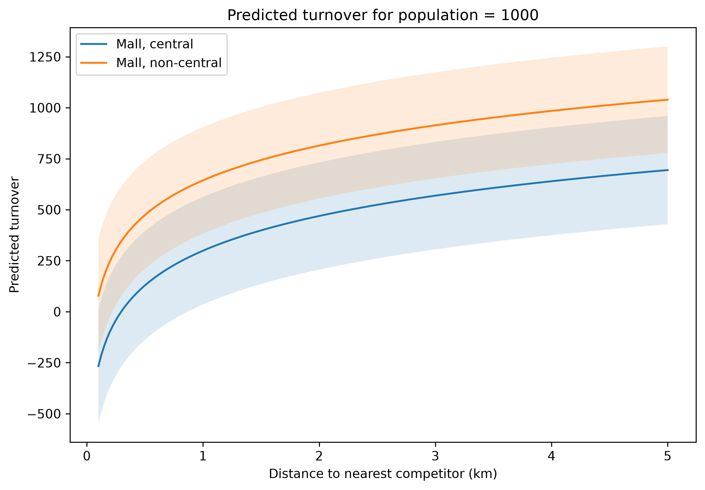
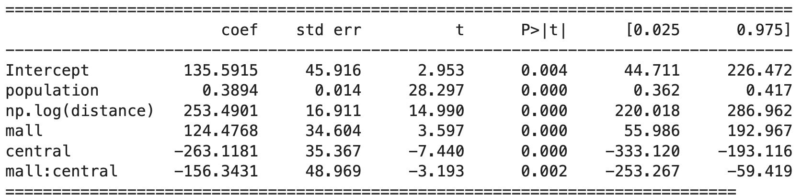
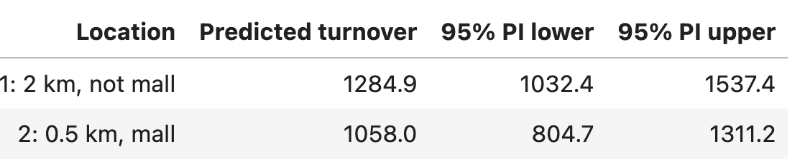

## First: Create Groups in Canvas

Find the desk with your group number:

- Log into Canvas
- Click on **People** on the right side of the page
- Click on **Group**
- Scroll to the group with the number on your desk and enroll yourself in the group (Regression Week 38)

## Plan for Today

- A short survey about the course
- Continue with the regression workshop
- Break
- Assignment

## About today's assignment

- The assignment has to be done with pen and paper (you do not need a computer)
- Collect all the sheet you use, mark them with the group number and deliver them to us
- In **Canvas**: Deliver a picture of the first sheet

## Our Data {.smaller}

Today we will work with the (simulated) *groceries.csv* dataset.

Here you find the following variables:

- **turnover**: Weekly turnover (measured in 1000 NOK).
- **population**: Number of people living within 1 km of the store.
- **distance**: Distance (in km) to the nearest competing grocery store.
- **central**: Indicator variable equal to 1 if the store is located in a city center, 0 otherwise.
- **mall**: Indicator variable equal to 1 if the store lies within a mall (shopping center), 0 otherwise.

```{r}
library(car)
library(ggplot2)
library(GGally)
library(patchwork)
library(tidyverse)
rm(list = ls())
groceries = read.csv("groceries.csv")

model0 = lm(turnover ~ population, data = groceries)

```

Our interest lies in predicting the weekly turnover based on the other available data.

## What we did last time

- Fit simple linear regression model

  - Interpret parameters
  - Check residuals
  - Predict (with uncertainty)

- Multiple Linear Regression

  - multiple covariates
  - transformations

## What we do today

- Multiple Linear Regression

  - categorical covariates
  - interactions

## Adding categorical covariates

We now want to check weather being in a mall or being in the city center has also an effect on the turnover.

**Model 4:**

$$\text{turnover} = \beta_0 + \beta_1 \text{population} + \beta_2 \text{log(distance)} $$

$$ + \beta_3 \text{mall} + \beta_4 \text{center} + \epsilon$$

## Adding categorical covariates {.smaller}

```{r}
model2 = lm(turnover ~ population + log(distance) + mall + central, data = groceries)
#summary(model2)
```



**Discuss:** How do you interpret the new parameters?

. . .

- If the store is in a mall it will, all other variable being equal, earn ca 46 000 NOK more per week compared to one that is not in a mall. This effect does not seem to be significant.

- Holding population, distance and mall status constant, the model predicts that city-centre stores have approximately 345 000 NOK lower weekly turnover than stores outside the city centre.

## Categorical variables - encoding {.smaller}

- Because mall and central are coded 0/1, the model compares:

  - mall = 1 vs mall = 0
  - central = 1 vs central = 0

- The coefficients for mall and central describe the difference relative to the 0 category (in this case "not in the mall" and "not in the center"), while keeping population and distance fixed.

- The same principle applies for variables with multiple categories, one category is the reference, the effects are differences from the reference category.

## Adding categorical covariates {.smaller}

**Model 4:**

$$\text{turnover} = \beta_0 + \beta_1 \text{population} + \beta_2 \text{log(distance)} + \beta_3 \text{mall} + \beta_4 \text{center} + \epsilon$$
In the next slide we show prediction for two shops, both in a mall, one in the center and one not, with population 1000 and distances to the nearest competitor ranging from 0.1 to 5 km (no intervals).

## Adding categorical covariates

Predictions:



## Adding categorical covariates

::::: columns
::: {.column width="50%"}
Confidence intervals: 
:::

::: {.column width="50%"}
Prediction intervals: 
:::
:::::

**Discuss:** What is the difference between these two types of intervals? Why is the prediction interval so wide?

## Interactions {.smaller}

What happens if a shop is in a mall *and* in the city center?

**Model 5:**

$$\text{turnover} = \beta_0 + \beta_1 \text{population} + \beta_2 \text{log(distance)} $$

$$+ \beta_3 \text{mall} + \beta_4 \text{center} + \beta_5 \text{mall} \cdot \text{center} + \epsilon$$

## Interactions {.smaller}



**Discuss:** If population and distance are the same;

- if two shops are in the city center, what is the difference between being in a mall or not?
- if two shops are not in the city center, what is the difference between being in a mall or not?

. . .

In city centre: approx 32 000 NOK higher turnover if in a mall

Outside city centre: approx 124 000 NOK higher turnover if in a mall

```{r}
model3 = lm(turnover ~ population + log(distance) + mall * central, data = groceries)
# summary(model3)
```

## Predictions and decision making {.smaller}

You are building a new store and have two locations to consider. Both are outside of a city center and have about 2500 inhabitants within the nearest 1 km.

The first location has a distance of 2 km to the nearest competitor, and is not within a mall. The second location is only 0.5 km from the nearest competitor, but is within a mall.

What is predicted turnover at the two locations? Calculate 95% prediction intervals. Is it clear, from the model, which location you should prefer?

Use our final model with interactions to evaluate this.

## Predictions and decision making {.smaller}



```{r}
ndata = data.frame(distance = c(2, 0.5),
                   population = c(2500,2500),
                   mall = c(0,1),
                   central = c(0,0))
#predict(model2, ndata, interval = "pred")
```
