## Time table {.smaller}

| Week | Date | Planned Activity | Delivery |
|---------------|:--------------|---------------------:|:--------------------:|
| 35 | ~~Wed 26.08~~ | ~~Visualization/Python~~ | ~~Yes (does not count)~~ |
|  | ~~Fri 28.08~~ | ~~Telling stories~~ | ~~Yes (5 points)~~ |
| 36 | ~~Wed 02.09~~ | ~~Visualization/Python~~ | ~~Yes (5 points)~~ |
|  | **Fri 04.09** | **Science and Data** | **No** |
| 37 | Wed 09.09 *Cancelled* | Homework: reading science paper | No |
|  | Fri 11.09 | Science and Data and Regression | Yes (5 points) |
| 38 | Wed 16.09 | Regression | Wed or Fri |
|  | Fri 18.09 | Regression | Wed or Fri |
| *39* | *Wed 23.09* | *Project 1* | *-* |
|  | *Fri 25.09* | *Project 1* | *First Hand-in* |
| *40* | *Wed 30.09* | *Project 1* | *-* |
|  | *Fri 02.10* | *Project 1* | *Second Hand-in* |

## Plan for today

-   Mix of lecture and group discussions

-   We are building up to next weeks discussion of a scientific paper

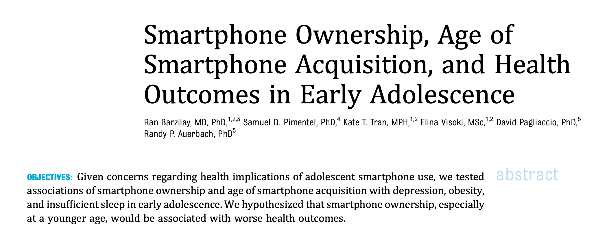

[Source: Pediatrics](https://doi.org/10.1542/peds.2025-072941)

## The scientific method

Speedy(!!) group discussion (3 min):

What are the steps of "the scientific method"?

## The scientific method

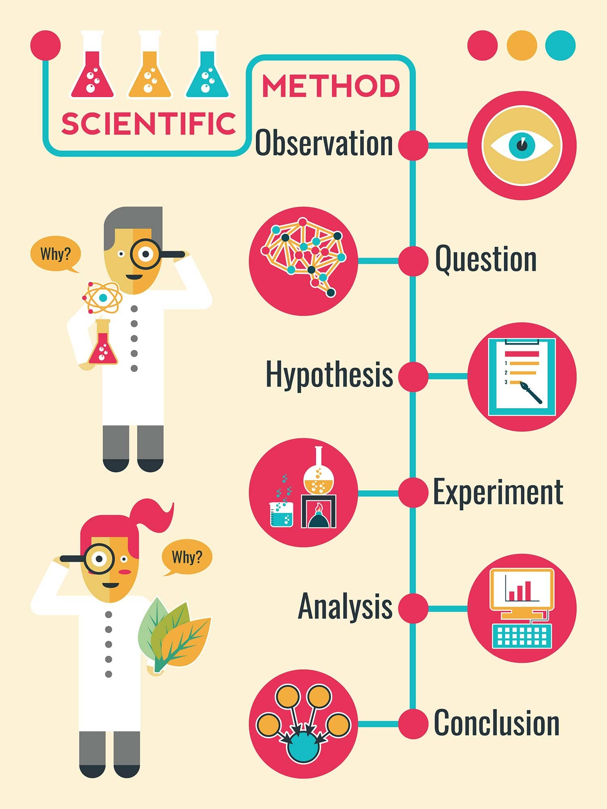

## The scientific method

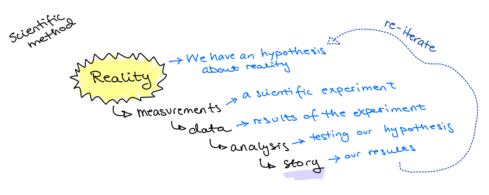

## The scientific method "2.0"

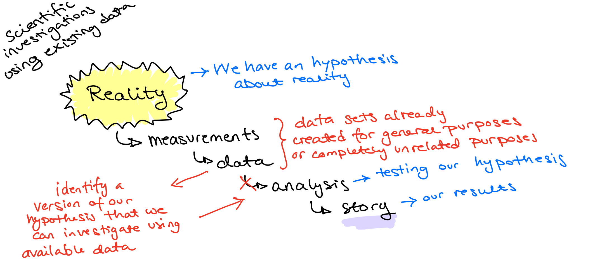

## Generating hypotheses from data

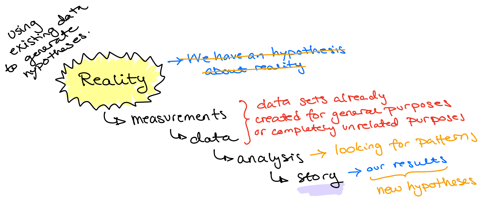

## Science and data

1st distinction to keep in mind when "the data shows that..."

-   Discovery: Searching for patterns, generating hypotheses

-   Confirmation / validation: Testing if a pattern is present in independent data

*Example:* An association between a genetic variant and a disease is found in the UK Biobank dataset (*discovery*) and then re-produced in the Norwegian HUNT dataset (*confirmation*)

## Science and data

2nd distinction to keep in mind when "the data shows that..."

-   Cause and effect: requires experiments, trials

-   Associations: can be found in all data sets

## Science and data

Today: Comparing two "things" (groups)

-   Before and after

-   With and without

-   Setting 1 and setting 2

## Comparing groups

Speedy group discussion (5 min):

What do you remember for a basic statistics group about comparing two groups?

## Comparing groups

TMA4240/45:

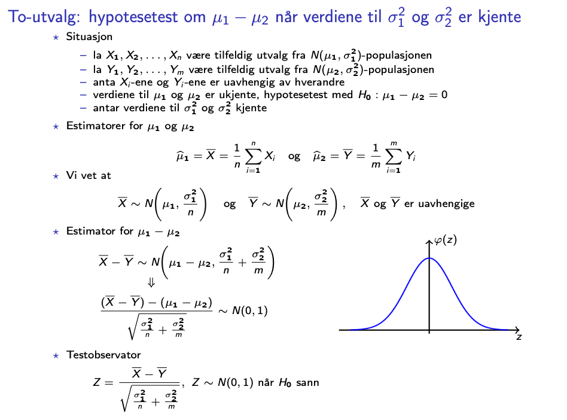{width="436"}

## Working example

Our *fake* example is motivated by the case study for next week in [Pediatrics](https://doi.org/10.1542/peds.2025-072941)

-   Outcome (what we care about): hours of sleep among children

-   Exposure (the thing we hypothesize may influence the outcome): owning a smartphone (yes/no)

*We imagine:* From a local school we have observations of 100 children in the 5th grade, 60 of them own a smartphone.

## Working example

**Step 1:** What do we want to compare across the groups (smartphone owners vs non-owners)?

-   The average hours of sleep in each group?

-   The median hours of sleep in each group?

-   The 25% percentile, i.e. the hours slept by the kid who is sleeps longest among the worst sleeping 1/4 of kids

(menti)

## Working example

**Step 2:** Formulating the null and alternative hypothesis

H~0~: The groups are equal

We aim to disprove H~0~, but in what direction? What is our alternative?

-   Kids without smartphones sleep more?

-   Kids without smartphones sleep less?

-   Unequal sleep but we will not specify which direction?

(menti)

## Working example

**Step 3:** Lets look at our data!

## Working example

**Step 3:** Lets look at our data!

**Step 4:** Is our difference really something?

The kids are unequal, so variation between kids is natural. By chance, two *randomly* selected groups will therefore also be different.

So what types of differences do we expect to occur *by chance*, and what types of differences are too large to occur *by chance*?

## Methods

*Examples:*

Assuming normal distribution of sleep hours and compare means using **t-tests**

Comparing distributions using a Mann–Whitney U test

Comparing the statistic of our choice using random permutations (we do this)

## Permutation testing

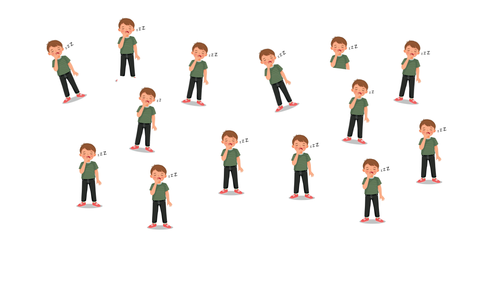

## Permutation testing

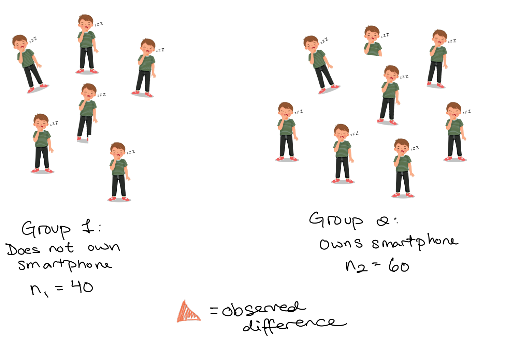

## Permutation testing

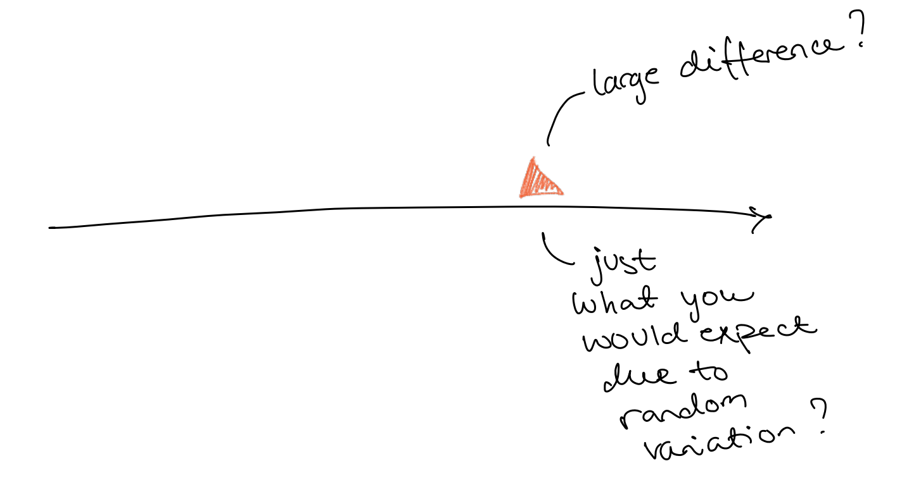

## Permutation testing

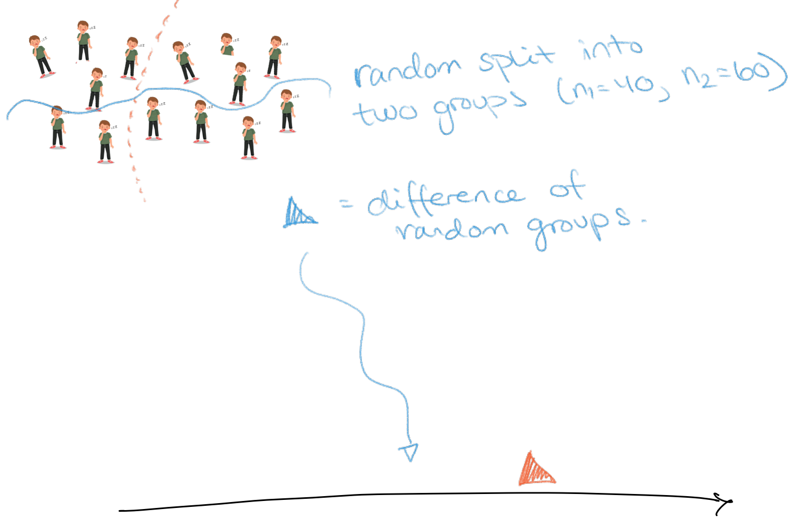

## Permutation testing

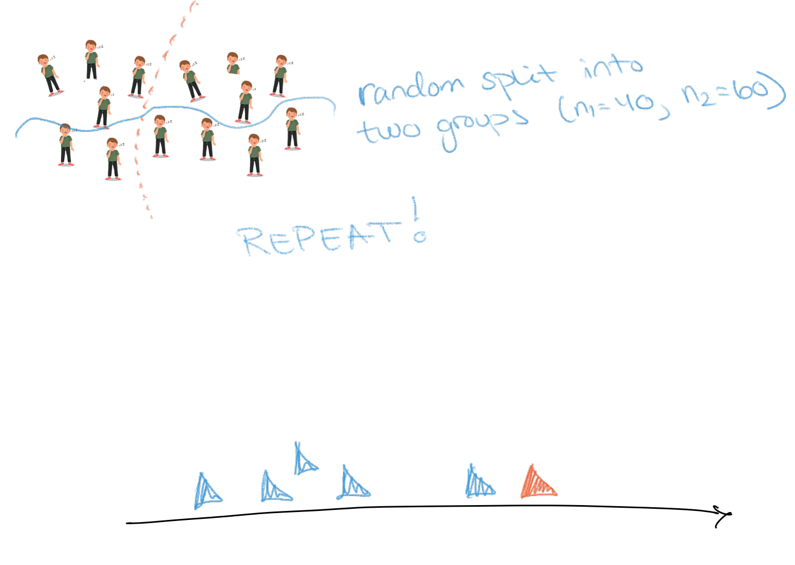

## Permutation testing

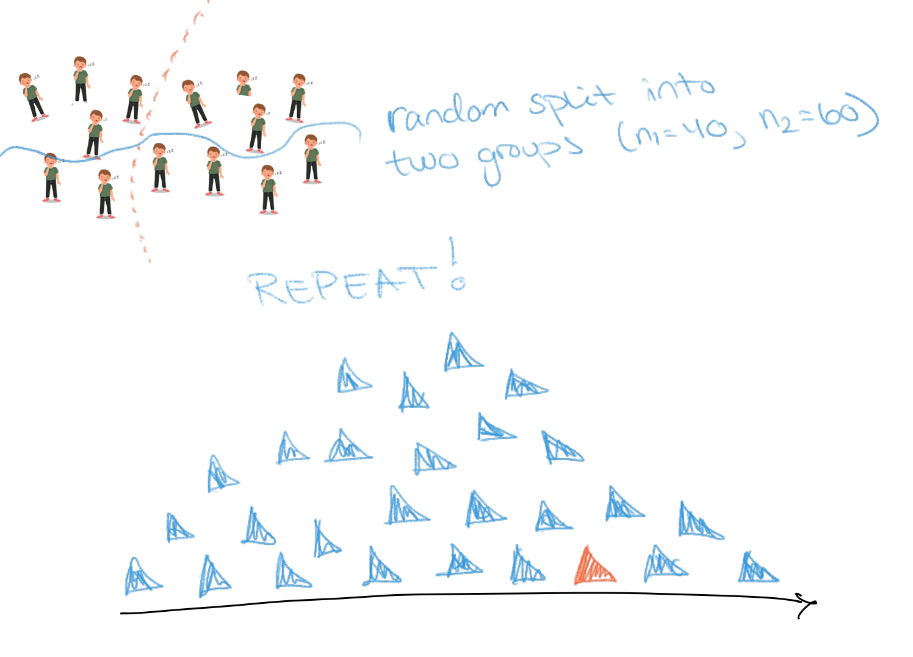

## Permutation testing

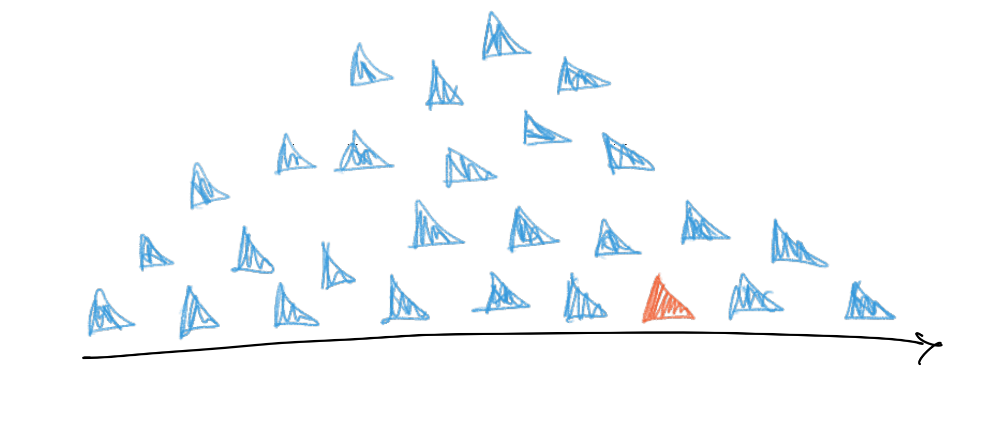

**P-value**: How likely is to observe what we have observed (orange triangle), or something even 'larger', if the null hypothesis is true?

**Group discussion** (5 min): How would you go about calculating the p-value based on these permutations? Give a number in Menti

## Working example

**Step 3:** Lets look at our data!

**Step 4:** Is our difference really something?

**Step 5:** We do permutations and look at our data again

## Permutation testing

1: We consider all the children as one large group and make a random split of n1 and n2 kids

2: We calculate the difference (e.g. difference in means) between these (artificial) groups

3: After many such random splits we have a distribution of differences that occur just "by chance"

4: We compare *our* observed difference to this distribution.

## P-hacking

What we just did:

-   Decided what to investigate and how

-   Did our investigation and compared to a "null distribution"

What we did not do:

-   Looked at the data from many angles

-   Found an interesting pattern

-   Chose a test that could "reveal" that pattern

-   "Cherry picking"

## P-hacking

(table of options and p-values +++ many tables according to exposures in the data set)

Just by chance there will be some small p-values in there and the whole concept then looses its meaning.

Multiple testing correction:

-   I did 100 tests and if i would normally consider p \< 0.05 to be "evidence" then i now have to look for p \< 0.05/100, i.e. p \< 0.0005.

## Estimates and confidence intervals

How many hours did the children actually sleep?

When we focus only on significance we might loose track of the actual numbers.
