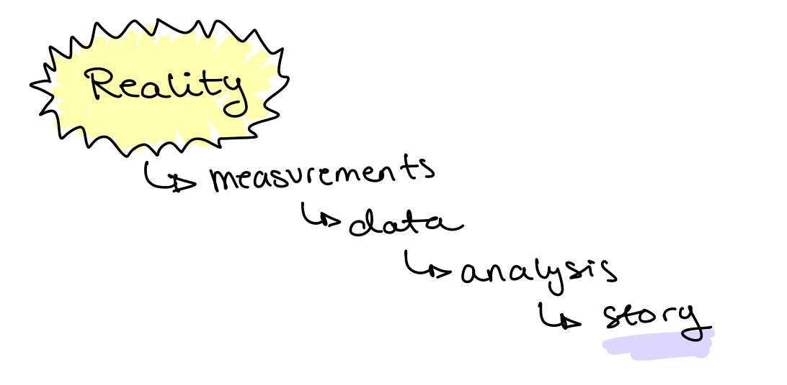
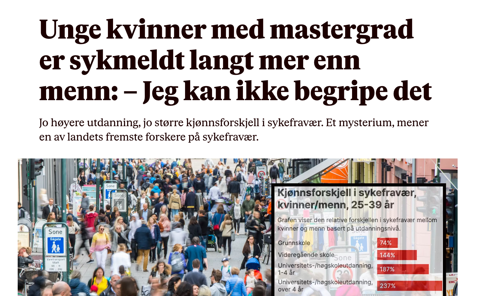
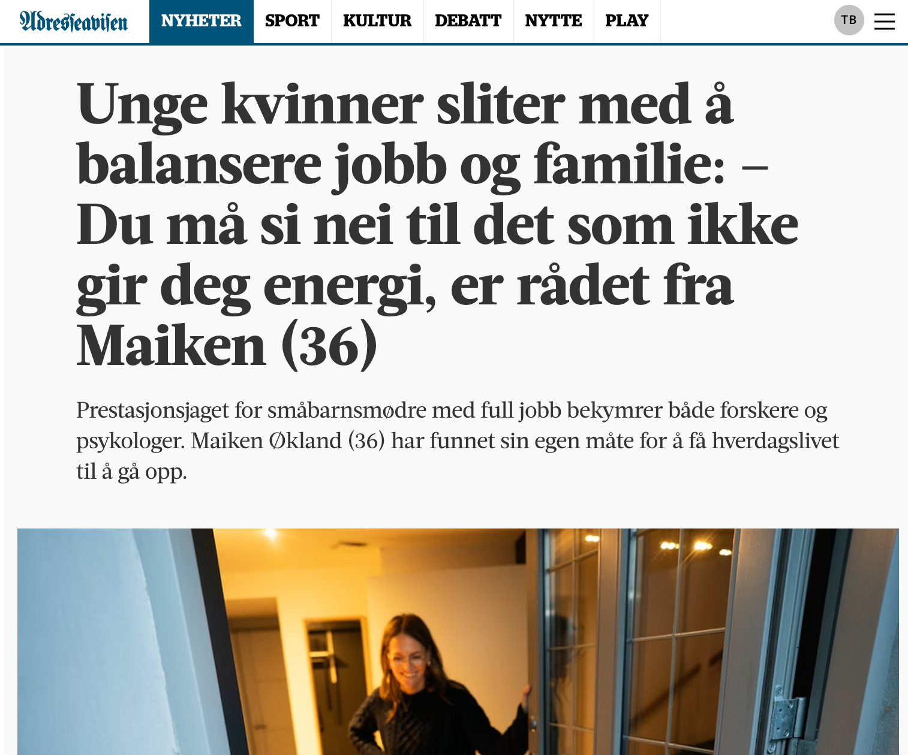
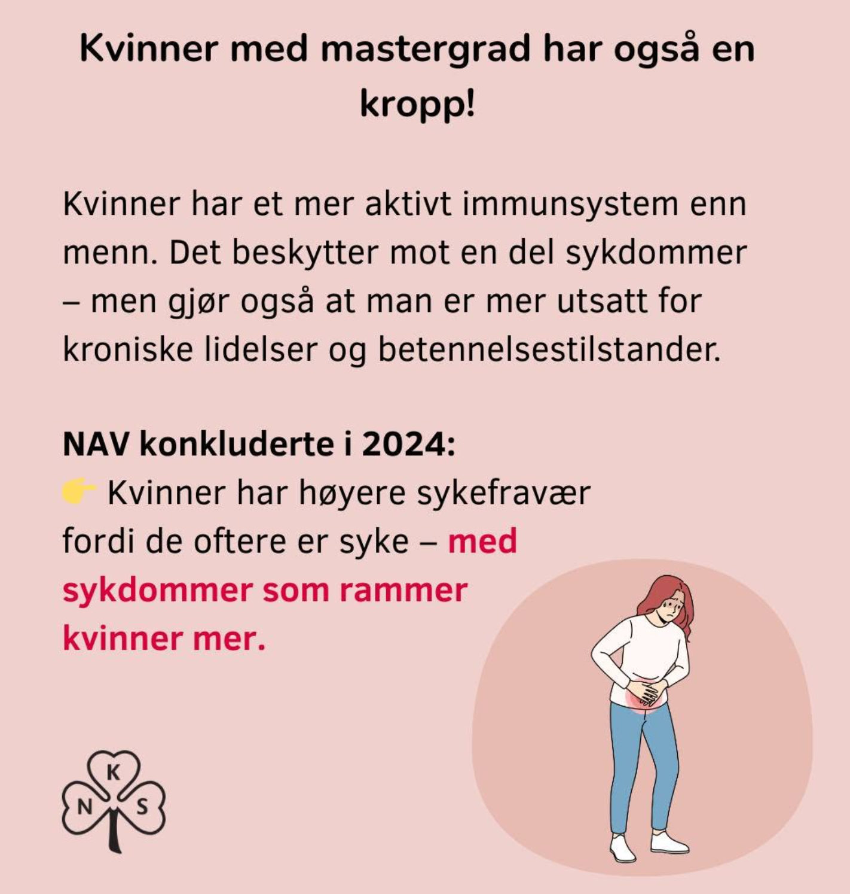

## First: Create Groups in Canvas

Find the desk with your group number **this is the same group number as last and next Wednesday**

-   Log into Canvas
-   Click on **People** on the right side of the page
-   Click on **Group**
-   Scroll to the group with the number on your desk and enroll yourself in the group (Telling stories Week 35)

**NOTE** Remember your Group number for next week, you will have to enroll again!!!

## Time table {.smaller}

| Week | Date          |         Planned Activity |         Delivery         |
|------|:--------------|-------------------------:|:------------------------:|
| 35   | ~~Wed 26.08~~ | ~~Visualization/Python~~ | ~~Yes (does not count)~~ |
|      | **Fri 28.08** |      **Telling stories** |    **Yes (5 points)**    |
| 36   | Wed 02.09     |     Visualization/Python |      Yes (5 points)      |
|      | Fri 04.09     |         Science and Data |            No            |
| 37   | Wed 09.09     |         Science and Data |      Yes (5 points)      |
|      | Fri 11.09     |               Regression |            No            |
| 38   | Wed 16.09     |               Regression |        Wed or Fri        |
|      | Fri 18.09     |               Regression |        Wed or Fri        |
| *39* | *Wed 23.09*   |              *Project 1* |           *-*            |
|      | *Fri 25.09*   |              *Project 1* |     *First Hand-in*      |
| *40* | *Wed 30.09*   |              *Project 1* |           *-*            |
|      | *Fri 02.10*   |              *Project 1* |     *Second Hand-in*     |

## Reference group

Please join the reference group!

## What WE learnt on Wednesday

   

Canvas deliveries take time

We plan 15 mins for this today

## What WE learnt on Wednesday

   

You are not AI /promt experts (yet)

## What YOU (perhaps) learnt on Wednesday

-   Canvas deliveries take time (we set 15 mins for this today)

-   Getting to know a data set takes time and can be confusing

-   There is no right answer, but some data summaries are more useful than others

-   A good visualisation is rarely the first one, you need to keep asking questions to the data

## Next Wednesday

-   We present answers from Ole Bernhard at Nofence
-   We give a task related to visualization of the Nofence data (with prize!)

## Soft skills

**Data Literacy**

Data literacy is the ability to read, work with, analyze and communicate data effectively.

It’s understanding what data means, how it’s created and how to use it so you can ask the right questions, interpret data correctly and make informed, evidence-based decisions.

    [Source: Databricks](https://www.databricks.com/blog/what-is-data-literacy)

## Soft skills

 

**The Five C's: Soft Skills That Every Data Analytics Professional Should Have**

Data analytics projects are fraught with uncertainties, ambiguities and numerous challenges such as unclear decision objectives, time and resource constraints, lack of expertise, poor quality data and ethical and privacy issues.

   

[Source: Forbes Technology council](https://www.forbes.com/councils/forbestechcouncil/2022/10/17/the-five-cs-soft-skills-that-every-data-analytics-professional-should-have/)

## Soft skills {.smaller}

1.  **Communication**
    -   Understand information accurately and quickly.
    -   Understand others' insight requirements and decision needs
    -   Avoid misunderstandings

## Soft skills {.smaller}

1.  **Communication**
2.  **Collaboration**
    -   Successfully work toward realizing a common goal
    -   Open-mindedness and respect

## Soft skills {.smaller}

1.  **Communication**
2.  **Collaboration**
3.  **Critical Thinking** Think rationally and logically and solve problems in a consistent and systematic manner.
    -   Question the hypothesis
    -   Identify biases
    -   Validate assumptions
    -   Select appropriate models
    -   Critique the accuracy of the analysis and results

## Soft skills {.smaller}

1.  **Communication**
2.  **Collaboration**
3.  **Critical Thinking**
4.  **Curiosity** Think rationally and logically and solve problems in a consistent and systematic manner.
    -   Continuously learn and expand knowledge
    -   Overcome obstacles by asking useful questions

## Soft skills {.smaller}

1.  **Communication**
2.  **Collaboration**
3.  **Critical Thinking**
4.  **Curiosity**
5.  **Creativity** Think rationally and logically and solve problems in a consistent and systematic manner.
    -   Continuously strive to generate new insights that are timely, accurate and relevant.
    -   Consider and explore divergent possibilities and perspectives

## Telling stories with data

{width="390"}

## Telling stories with data

  

"Pairing **reliable data** with a **coherent narrative** and a **clear visualization** will create those “aha” moments that engage the audience."

     

[Source: The Data Literacy Project](https://thedataliteracyproject.org/data-literacy-mindsets-storytelling-and-communicating)

## Today: case study

August 2025: Norwegian newspaper VG presents a story with the headline:

"Young women with a master's degree are on sick leave far more than men"

{width="770"}

## Today: case study

E24: "The good girls are tired now"

{width="800"}

## Today: case study

VG (again): "Today's working life is made for a man in the 1970s"

## Today: case study

Adressa: "Young women struggle to balance work and family: - Say no to things that do not give you energy"

## Today: case study

Norwegian Women's Public Health Association: "Women with a masters' degree also have bodies"

## Today: case study {.smaller}

**Part 0:**

Open a document (word or what you prefer) for writing down the groups' reflections. Headlines should be Part 1, Part 2, Part 3, Part 4.

We do Parts 1 and 2 first, then 3 and 4. 

 

## Today: case study {.smaller}

**Part 1:** Use the statement from the Data Literacy Project:

*"Pairing **reliable data** with a **coherent narrative** and a **clear visualization** will create those “aha” moments that engage the audience."*

Discuss the VG article (header and visualization). Why do you think this story was successful? How do you interpret the numbers in the figure?

**Part 2:**  Consider all the elements of this figure in relation to the VG article.

::::: columns
::: {.column width="30%"}

:::

::: {.column width="70%"}
-   Reality: What is is we are trying to describe?

-   Measurements: What measurements are done and who are included? Who and what is not included?

-   Data: What is the raw data?

-   Analysis: What analysis was done with the raw data?

-   Story: What is the final story?

:::
:::::

::: aside
*Note:* The data are from SSB (Statistics Norway), first quarter 2025.
:::

## Today: case study {.smaller}

**Part 3:**

The table gives the raw data from SSB (statistics Norway).

Consider "the story" (the headline + visualization) in relation to the data.

Would you say that "they story" is a good representation of reality? Why or why not?

Is "the story" relevant for decision makers?

If you were the decision maker, which group(s) would you be worried about?

   

**Part 4:**

Can statistics and data science be neutral? Why / why not?

What other than neutrality should we strive for?
